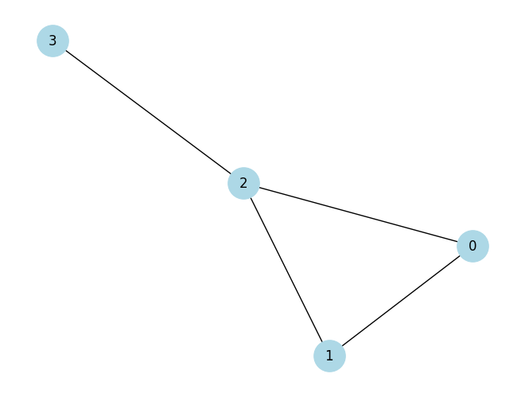
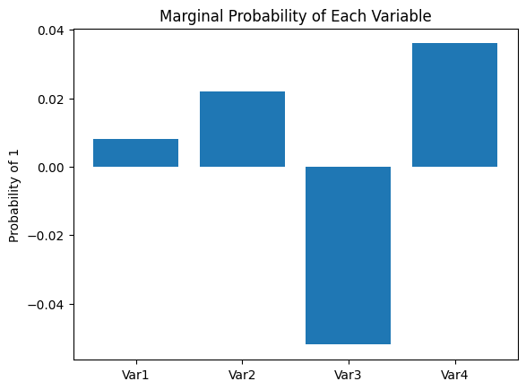

# Archived Notebook Results

Executed outputs from archived notebooks retained for historical reference.

## Environment

- Generated: 2026-05-22 00:44:45 UTC
- Git commit: `9496565`
- Python: `3.12.1`
- Package version: `0.2.0`
- Matplotlib backend: `Agg`

## Summary

| Notebook | Text result blocks | Plots |
| --- | ---: | ---: |
| [notebooks/archive/01-qaoa-max-cut.ipynb](#quantum-approximate-optimization-algorithm-qaoa) | 1 | 2 |

## Quantum Approximate Optimization Algorithm (QAOA)

Notebook: `notebooks/archive/01-qaoa-max-cut.ipynb`

Result block 1:

```text
Step 10: cost = 1.0000
Step 20: cost = 1.0000
Step 30: cost = 1.0000
Step 40: cost = 1.0000
Step 50: cost = 1.0000
```




## Reproduce

Regenerate notebook result pages from existing executed notebook outputs:

```bash
python docs/pages/generate_results.py --skip-api-results
```

Execute notebooks first, then regenerate result pages:

```bash
python docs/pages/generate_results.py --skip-api-results --execute-notebooks
```
