# Tutorial Notebook Results

Executed outputs from the tutorial notebooks in `notebooks/tutorials/`. These pages are generated from notebook outputs, including text tables and plots.

## Environment

- Generated: 2026-05-22 05:40:05 UTC
- Git commit: `a29a07a`
- Python: `3.12.1`
- Package version: `0.2.3`
- Matplotlib backend: `Agg`

## Summary

| Notebook | Text result blocks | Plots |
| --- | ---: | ---: |
| [notebooks/tutorials/01-classical-vs-quantum-classifier.ipynb](#classical-vs-quantum-classifiers) | 4 | 6 |
| [notebooks/tutorials/02-classical-vs-quantum-regressor.ipynb](#classical-vs-quantum-regression) | 3 | 5 |
| [notebooks/tutorials/03-variational-quantum-classifier.ipynb](#quantum-variational-classifier) | 3 | 3 |
| [notebooks/tutorials/04-variational-quantum-regressor.ipynb](#variational-quantum-regressor) | 3 | 3 |
| [notebooks/tutorials/05-quantum-kernel-classifier.ipynb](#quantum-kernel-classifier) | 4 | 3 |
| [notebooks/tutorials/06-quantum-kernel-estimators.ipynb](#reusable-quantum-kernel-estimators) | 3 | 1 |
| [notebooks/tutorials/07-variational-quantum-estimators.ipynb](#dataset-agnostic-variational-quantum-estimators) | 3 | 1 |
| [notebooks/tutorials/08-sequence-window-quantum-forecasting.ipynb](#sequence-windows-for-quantum-forecasting) | 3 | 1 |
| [notebooks/tutorials/09-quantum-metric-learning.ipynb](#quantum-metric-learning) | 4 | 5 |
| [notebooks/tutorials/10-quantum-convolutional-neural-network.ipynb](#quantum-convolutional-neural-network) | 4 | 3 |
| [notebooks/tutorials/11-quantum-autoencoder.ipynb](#quantum-autoencoder) | 3 | 1 |

## Classical vs Quantum Classifiers

Notebook: `notebooks/tutorials/01-classical-vs-quantum-classifier.ipynb`

Result block 1:

```text
VQC train accuracy: 0.84
VQC test accuracy: 0.92
```
Result block 2:

```text
Quantum kernel train accuracy: 0.8666666666666667
Quantum kernel test accuracy: 0.92
```
Result block 3:

```text
Classical SVM train accuracy: 0.96
Classical SVM test accuracy: 1.0
```
Result block 4:

```text
{'VQC': {'train_accuracy': 0.84, 'test_accuracy': 0.92},
 'Quantum kernel': {'train_accuracy': 0.8666666666666667,
  'test_accuracy': 0.92},
 'Classical SVM': {'train_accuracy': 0.96, 'test_accuracy': 1.0}}
```

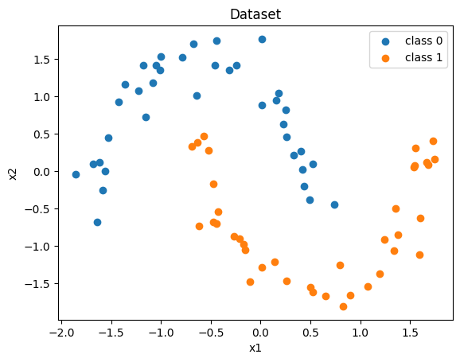

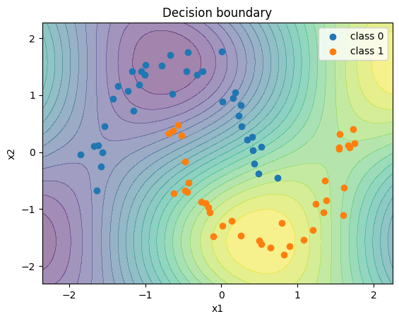


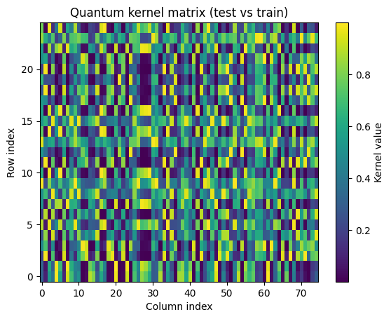

## Classical vs quantum regression

Notebook: `notebooks/tutorials/02-classical-vs-quantum-regressor.ipynb`

Result block 1:

```text
[{'model': 'VQR',
  'train_mse': 0.29700758438371283,
  'test_mse': 0.17865945115851434,
  'train_mae': 0.23254695445727222,
  'test_mae': 0.20425433701803775},
 {'model': 'Ridge',
  'train_mse': 4.490711703649848e-05,
  'test_mse': 4.315219471074882e-05,
  'train_mae': 0.00516673344748882,
  'test_mae': 0.005244853133929798},
 {'model': 'MLP',
  'train_mse': 0.0057038784522001765,
  'test_mse': 0.004103491527765519,
  'train_mae': 0.05753716767756181,
  'test_mae': 0.05229663963250704}]
```
Result block 2:

```text
VQR | train MSE = 0.297008 | test MSE = 0.178659 | train MAE = 0.232547 | test MAE = 0.204254
Ridge | train MSE = 0.000045 | test MSE = 0.000043 | train MAE = 0.005167 | test MAE = 0.005245
  MLP | train MSE = 0.005704 | test MSE = 0.004103 | train MAE = 0.057537 | test MAE = 0.052297
```
Result block 3:

```text
Lowest test MSE: Ridge (0.000043)
Lowest test MAE: Ridge (0.005245)
```

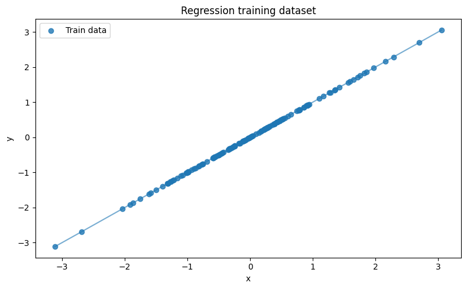
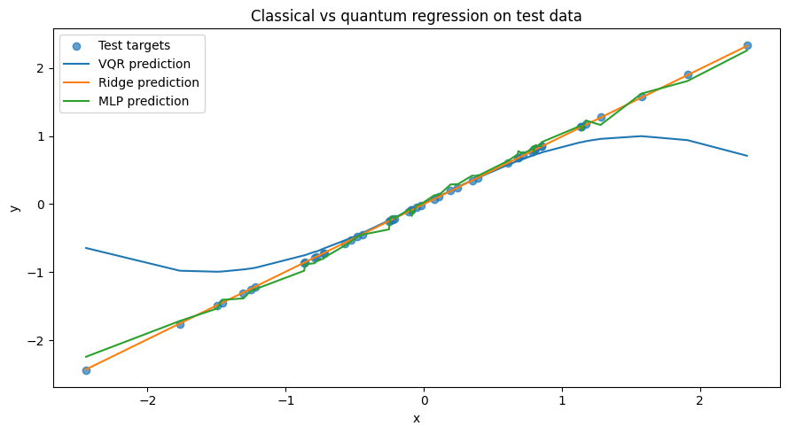
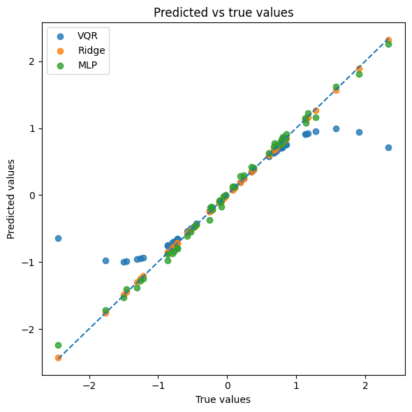
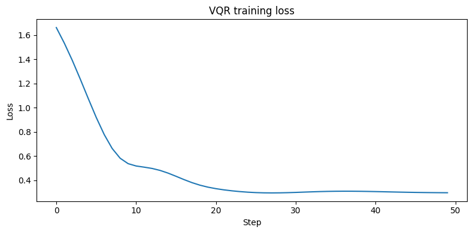
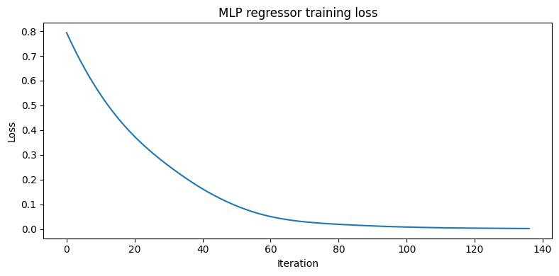

## Quantum Variational Classifier

Notebook: `notebooks/tutorials/03-variational-quantum-classifier.ipynb`

Result block 1:

```text
Train accuracy: 0.8533333333333334
Test accuracy: 0.84
Final loss: 0.3296512422612351
```
Result block 2:

```text
[1.3637149385725453,
 1.3106343893072079,
 1.150096754736344,
 0.9990183939256337,
 0.8762037652494321,
 0.775059270097408,
 0.6885867746531164,
 0.613274820659994,
 0.5479665993633804,
 0.4922192570203015]
```
Result block 3:

```text
['ansatz_params',
 'dataset',
 'early_stopping_min_delta',
 'early_stopping_patience',
 'embedding',
 'embedding_layers',
 'embedding_params',
 'final_loss',
 'loss_history',
 'model',
 'n_layers',
 'n_qubits',
 'n_samples',
 'noise',
 'optimizer',
 'optimizer_kwargs',
 'params',
 'seed',
 'shots',
 'step_size',
 'steps',
 'test_accuracy',
 'test_probabilities',
 'test_size',
 'train_accuracy',
 'train_probabilities',
 'y_test',
 'y_test_pred',
 'y_train',
 'y_train_pred']
```

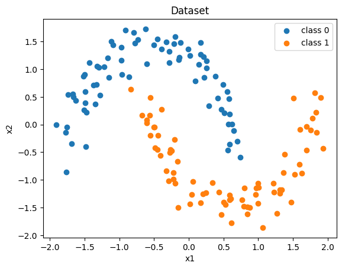
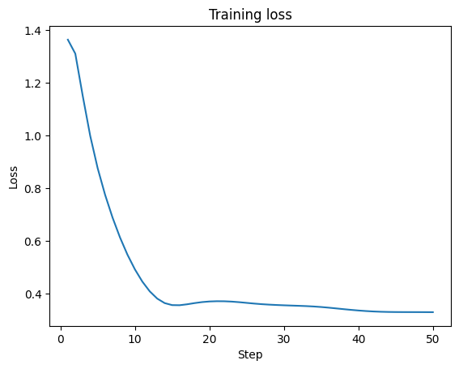
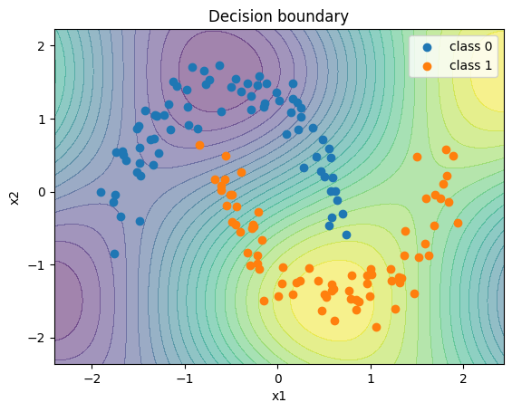

## Variational Quantum Regressor

Notebook: `notebooks/tutorials/04-variational-quantum-regressor.ipynb`

Result block 1:

```text
Train MSE: 0.5133790198164415
Test MSE: 0.5351584510286133
Train MAE: 0.5291734269340835
Test MAE: 0.49500624808166144
Final loss: 0.5160344040102691
```
Result block 2:

```text
[1.53959574370404,
 1.480014268088658,
 1.4249729606232324,
 1.3747701545384936,
 1.3292252417575974,
 1.287867793360639,
 1.2495917135548547,
 1.2127663351701832,
 1.1754339606139674,
 1.1359078512368066]
```
Result block 3:

```text
['dataset',
 'early_stopping_min_delta',
 'early_stopping_patience',
 'final_loss',
 'loss_history',
 'model',
 'n_layers',
 'n_qubits',
 'n_samples',
 'noise',
 'optimizer',
 'optimizer_kwargs',
 'params',
 'seed',
 'shots',
 'step_size',
 'steps',
 'test_mae',
 'test_mse',
 'test_size',
 'train_mae',
 'train_mse',
 'x_test',
 'x_train',
 'y_test',
 'y_test_pred',
 'y_train',
 'y_train_pred']
```

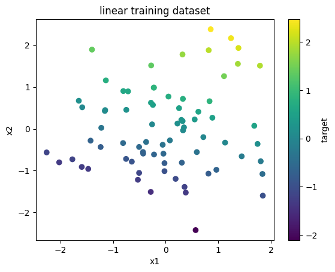
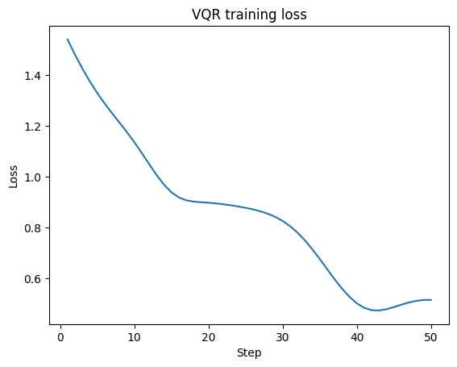
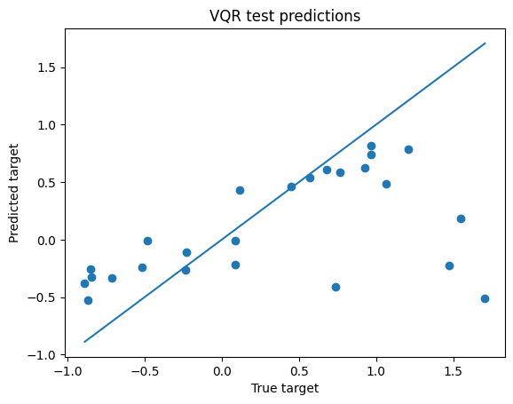

## Quantum Kernel Classifier

Notebook: `notebooks/tutorials/05-quantum-kernel-classifier.ipynb`

Result block 1:

```text
Train accuracy: 0.8666666666666667
Test accuracy: 0.92
```
Result block 2:

```text
(75, 75)
```
Result block 3:

```text
array([1, 1, 0, 0, 0, 1, 0, 1, 0, 1])
```
Result block 4:

```text
['dataset',
 'embedding',
 'kernel_matrix_test',
 'kernel_matrix_train',
 'model',
 'n_qubits',
 'n_samples',
 'noise',
 'seed',
 'shots',
 'test_accuracy',
 'test_size',
 'train_accuracy',
 'x_test',
 'x_train',
 'y_test',
 'y_test_pred',
 'y_train',
 'y_train_pred']
```

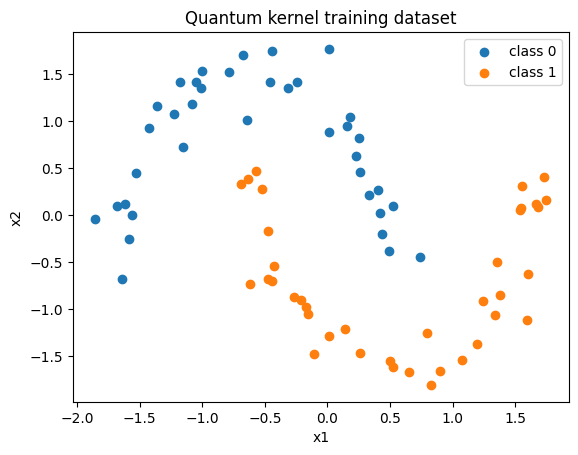
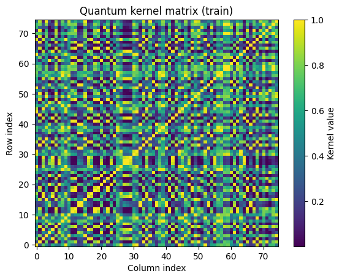


## Reusable Quantum Kernel Estimators

Notebook: `notebooks/tutorials/06-quantum-kernel-estimators.ipynb`

Result block 1:

```text
Dataset
+------------------------------+---------------------+
| Metric                       | Value               |
+------------------------------+---------------------+
| Classification samples       | 20                  |
| Classification feature_shape | [20, 2]             |
| Regression samples           | 20                  |
| Regression feature_shape     | [20, 2]             |
| Regression target range      | [-0.89437, 0.46061] |
+------------------------------+---------------------+
```
Result block 2:

```text
Results
+-----------------------------+-----------+
| Metric                      | Value     |
+-----------------------------+-----------+
| Kernel-target alignment     | 0.634204  |
| Quantum classifier accuracy | 1         |
| SVC classifier accuracy     | 1         |
| Quantum regression MAE      | 0.0861475 |
| Quantum regression MSE      | 0.0186331 |
| Kernel ridge regression MAE | 0.0208563 |
+-----------------------------+-----------+
```
Result block 3:

```text
Validation
Dataset
+------------------------------+--------------------------------------+
| Metric                       | Value                                |
+------------------------------+--------------------------------------+
| Problem                      | reusable_quantum_kernel_estimators   |
| Classification features      | [sensor_feature_1, sensor_feature_2] |
| Classification target        | operating_regime                     |
| Regression features          | [calibration_axis, cosine_feature]   |
| Regression target            | calibration_value                    |
| Classification train samples | 14                                   |
| Classification test samples  | 6                                    |
| Regression train samples     | 14                                   |
| Regression test samples      | 6                                    |
+------------------------------+--------------------------------------+

Results
+-----------------------------+-----------+
| Metric                      | Value     |
+-----------------------------+-----------+
| Kernel-target alignment     | 0.634204  |
| Quantum classifier accuracy | 1         |
| SVC classifier accuracy     | 1         |
| Quantum regression MAE      | 0.0861475 |
| Quantum regression MSE      | 0.0186331 |
| Kernel ridge regression MAE | 0.0208563 |
+-----------------------------+-----------+

Sample classification predictions
1. Actual: 0, Quantum: 0, SVC: 0
2. Actual: 0, Quantum: 0, SVC: 0
3. Actual: 0, Quantum: 0, SVC: 0
4. Actual: 1, Quantum: 1, SVC: 1
5. Actual: 1, Quantum: 1, SVC: 1
6. Actual: 1, Quantum: 1, SVC: 1

Sample regression predictions
1. Actual: -0.172629, Quantum: -0.109190, Kernel ridge: -0.155921
2. Actual: 0.410242, Quantum: 0.425287, Kernel ridge: 0.402479
3. Actual: -0.764573, Quantum: -0.791361, Kernel ridge: -0.777201
4. Actual: 0.457576, Quantum: 0.428382, Kernel ridge: 0.464813
5. Actual: 0.460610, Quantum: 0.397573, Kernel ridge: 0.465578
6. Actual: 0.250000, Quantum: -0.069381, Kernel ridge: 0.174167

Interpretation
The reusable quantum kernel estimators produced finite predictions and useful held-out metrics.
Classical baselines are included as sanity checks; no quantum advantage is claimed.

Passed: True
```

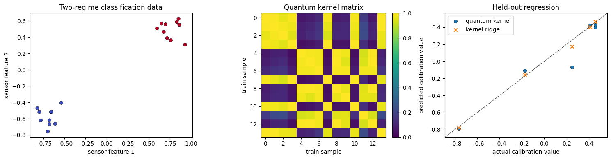

## Dataset-Agnostic Variational Quantum Estimators

Notebook: `notebooks/tutorials/07-variational-quantum-estimators.ipynb`

Result block 1:

```text
Dataset
+------------------------------+-----------+
| Metric                       | Value     |
+------------------------------+-----------+
| Classification samples       | 15        |
| Classification feature_shape | [15, 2]   |
| Classes                      | [0, 1, 2] |
| Regression samples           | 6         |
| Regression feature_shape     | [6, 2]    |
| Regression target_shape      | [6, 2]    |
+------------------------------+-----------+
```
Result block 2:

```text
Results
+------------------------------+-------------+
| Metric                       | Value       |
+------------------------------+-------------+
| Quantum classifier accuracy  | 0.666667    |
| SVC classifier accuracy      | 1           |
| Quantum regression MAE       | 0.393804    |
| Quantum regression MSE       | 0.207483    |
| Ridge regression MAE         | 0.000269655 |
| Classifier initial loss mean | 0.776098    |
| Classifier final loss mean   | 0.392458    |
| Regressor initial loss mean  | 0.34266     |
| Regressor final loss mean    | 0.211391    |
+------------------------------+-------------+
```
Result block 3:

```text
Validation
Dataset
+-------------------------+------------------------------------------+
| Metric                  | Value                                    |
+-------------------------+------------------------------------------+
| Problem                 | dataset_agnostic_variational_estimators  |
| Classification features | [feature_1, feature_2]                   |
| Classification target   | operating_regime                         |
| Regression features     | [input_1, input_2]                       |
| Regression targets      | [response_channel_1, response_channel_2] |
| Classification samples  | 15                                       |
| Regression samples      | 6                                        |
+-------------------------+------------------------------------------+

Results
+------------------------------+-------------+
| Metric                       | Value       |
+------------------------------+-------------+
| Quantum classifier accuracy  | 0.666667    |
| SVC classifier accuracy      | 1           |
| Quantum regression MAE       | 0.393804    |
| Quantum regression MSE       | 0.207483    |
| Ridge regression MAE         | 0.000269655 |
| Classifier initial loss mean | 0.776098    |
| Classifier final loss mean   | 0.392458    |
| Regressor initial loss mean  | 0.34266     |
| Regressor final loss mean    | 0.211391    |
+------------------------------+-------------+

Sample class predictions
1. Actual: 0, Quantum: 2, SVC: 0, Probabilities: [0.4941, 0.0114, 0.4945]
2. Actual: 0, Quantum: 2, SVC: 0, Probabilities: [0.4738, 0.0519, 0.4743]
3. Actual: 0, Quantum: 2, SVC: 0, Probabilities: [0.4949, 0.0097, 0.4954]
4. Actual: 0, Quantum: 2, SVC: 0, Probabilities: [0.4712, 0.057, 0.4717]
5. Actual: 0, Quantum: 2, SVC: 0, Probabilities: [0.4952, 0.0091, 0.4956]
6. Actual: 1, Quantum: 1, SVC: 1, Probabilities: [0.0797, 0.8408, 0.0795]

Sample regression predictions
1. Actual: [-0.2, -0.1], Quantum: [-0.523667, -0.517271], Ridge: [-0.199475, -0.10035]
2. Actual: [-0.04, -0.04], Quantum: [0.034384, 0.041868], Ridge: [-0.04019, -0.039824]
3. Actual: [0.12, 0.08], Quantum: [0.580979, 0.587058], Ridge: [0.119784, 0.080175]
4. Actual: [0.28, 0.2], Quantum: [0.934008, 0.936657], Ridge: [0.279758, 0.200175]

Interpretation
The sklearn-like quantum estimators fit, expose learned attributes, and return finite predictions.
The validation threshold is intentionally modest because this notebook is an API usage example, not a benchmark claim.

Passed: True
```

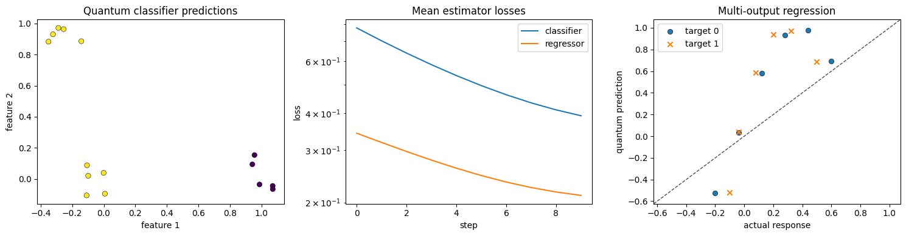

## Sequence Windows for Quantum Forecasting

Notebook: `notebooks/tutorials/08-sequence-window-quantum-forecasting.ipynb`

Result block 1:

```text
Dataset
+------------------------+---------+
| Metric                 | Value   |
+------------------------+---------+
| Raw signal steps       | 44      |
| Window size            | 3       |
| Horizon                | 1       |
| Windowed feature_shape | [41, 3] |
| Target shape           | [41]    |
| Train windows          | 30      |
| Test windows           | 11      |
+------------------------+---------+
```
Result block 2:

```text
Results
+----------------------+----------+
| Metric               | Value    |
+----------------------+----------+
| Quantum forecast MAE | 0.406761 |
| Quantum forecast MSE | 0.207272 |
| Ridge forecast MAE   | 0.182912 |
| Initial loss         | 0.715744 |
| Final loss           | 0.222213 |
| Loss steps           | 20       |
+----------------------+----------+
```
Result block 3:

```text
Validation
Dataset
+------------------+--------------------------------------------------------+
| Metric           | Value                                                  |
+------------------+--------------------------------------------------------+
| Problem          | sequence_window_quantum_forecasting                    |
| Features         | [signal_t_minus_2, signal_t_minus_1, signal_t_minus_0] |
| Target           | next_signal_value                                      |
| Raw signal steps | 44                                                     |
| Train windows    | 30                                                     |
| Test windows     | 11                                                     |
+------------------+--------------------------------------------------------+

Results
+----------------------+----------+
| Metric               | Value    |
+----------------------+----------+
| Quantum forecast MAE | 0.406761 |
| Quantum forecast MSE | 0.207272 |
| Ridge forecast MAE   | 0.182912 |
| Initial loss         | 0.715744 |
| Final loss           | 0.222213 |
| Loss steps           | 20       |
+----------------------+----------+

Sample forecasts
1. Actual: 0.569579, Quantum: 0.107778, Ridge: 0.342875
2. Actual: 0.864542, Quantum: 0.942297, Ridge: 1.049405
3. Actual: 0.850233, Quantum: 0.522847, Ridge: 0.875183
4. Actual: 0.856505, Quantum: 0.144220, Ridge: 0.549189
5. Actual: 0.490632, Quantum: 0.163618, Ridge: 0.522962
6. Actual: -0.309106, Quantum: 0.140184, Ridge: 0.009358

Interpretation
The preprocessing helper created valid supervised windows and the quantum regressor reduced training loss.
The ridge baseline is included as a sanity check; no quantum advantage is claimed.

Passed: True
```

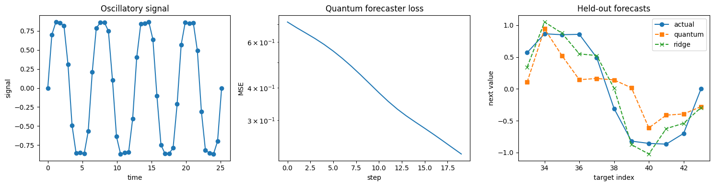

## Quantum Metric Learning

Notebook: `notebooks/tutorials/09-quantum-metric-learning.ipynb`

Result block 1:

```text
[metric_learning] step=0001 loss=0.427937
[metric_learning] step=0010 loss=0.305071
[metric_learning] step=0020 loss=0.298624
[metric_learning] step=0030 loss=0.255549
[metric_learning] step=0040 loss=0.286283
[metric_learning] step=0050 loss=0.260128
[metric_learning] step=0060 loss=0.143402
[metric_learning] step=0070 loss=0.156889
[metric_learning] step=0075 loss=0.098516
Train accuracy: 0.6111111111111112
Test accuracy: 0.6
Final loss: 0.09851639525405846
```
Result block 2:

```text
Train embedding shape: (90, 2)
Test embedding shape: (30, 2)
```
Result block 3:

```text
[metric_learning] step=0001 loss=0.087691
[metric_learning] step=0010 loss=0.225662
[metric_learning] step=0020 loss=0.134055
[metric_learning] step=0030 loss=0.130827
[metric_learning] step=0040 loss=0.144779
[metric_learning] step=0050 loss=0.261926
[metric_learning] step=0060 loss=0.167996
[metric_learning] step=0070 loss=0.194980
[metric_learning] step=0075 loss=0.151230
layers=1 test accuracy: 0.7
```
Result block 4:

```text
[metric_learning] step=0001 loss=0.427937
[metric_learning] step=0010 loss=0.305071
[metric_learning] step=0020 loss=0.298624
[metric_learning] step=0030 loss=0.255549
[metric_learning] step=0040 loss=0.286283
[metric_learning] step=0050 loss=0.260128
[metric_learning] step=0060 loss=0.143402
[metric_learning] step=0070 loss=0.156889
[metric_learning] step=0075 loss=0.098516
moons
  train accuracy: 0.6111111111111112
  test accuracy: 0.6
[metric_learning] step=0001 loss=0.356441
[metric_learning] step=0010 loss=0.428865
[metric_learning] step=0020 loss=0.303805
[metric_learning] step=0030 loss=0.204626
[metric_learning] step=0040 loss=0.247740
[metric_learning] step=0050 loss=0.143872
[metric_learning] step=0060 loss=0.121123
[metric_learning] step=0070 loss=0.149328
[metric_learning] step=0075 loss=0.112340
circles
  train accuracy: 0.7222222222222222
  test accuracy: 0.6333333333333333
[metric_learning] step=0001 loss=0.140471
[metric_learning] step=0010 loss=0.056122
[metric_learning] step=0020 loss=0.094982
[metric_learning] step=0030 loss=0.065302
[metric_learning] step=0040 loss=0.064415
[metric_learning] step=0050 loss=0.110236
[metric_learning] step=0060 loss=0.092765
[metric_learning] step=0070 loss=0.086375
[metric_learning] step=0075 loss=0.093646
blobs
  train accuracy: 0.9
  test accuracy: 0.9
```

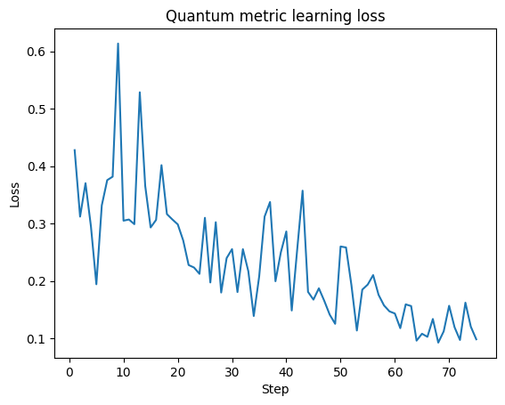
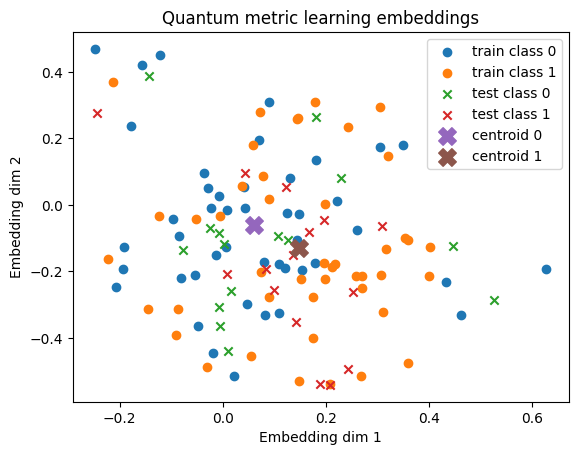

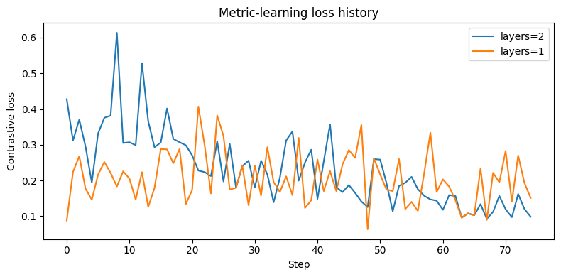
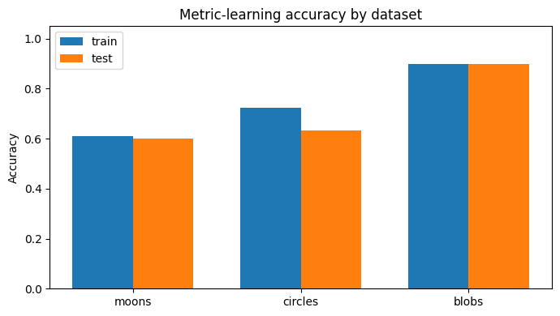

## Quantum Convolutional Neural Network

Notebook: `notebooks/tutorials/10-quantum-convolutional-neural-network.ipynb`

Result block 1:

```text
Train accuracy: 0.9444444444444444
Test accuracy: 1.0
Final loss: 0.42221349893739046
```
Result block 2:

```text
Embedding params shape: (4, 3)
First convolution block shape: (2, 6)
Second convolution block shape: (1, 6)
Dense readout params shape: (2,)
```
Result block 3:

```text
moons
  train accuracy: 0.6666666666666666
  test accuracy: 0.8
circles
  train accuracy: 0.4666666666666667
  test accuracy: 0.4
blobs
  train accuracy: 1.0
  test accuracy: 1.0
xor
  train accuracy: 0.5333333333333333
  test accuracy: 0.4
```
Result block 4:

```text
Finite-shot train accuracy: 0.4666666666666667
Finite-shot test accuracy: 1.0
Finite-shot final loss: 2.022702148492722
```

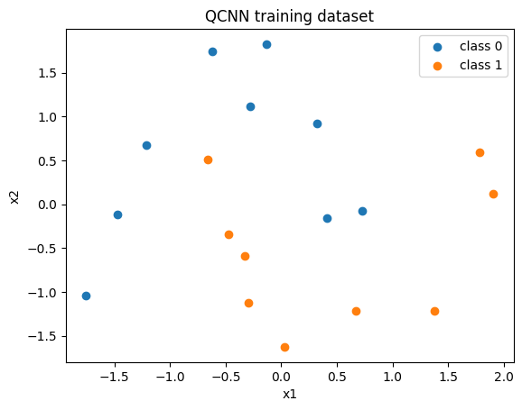
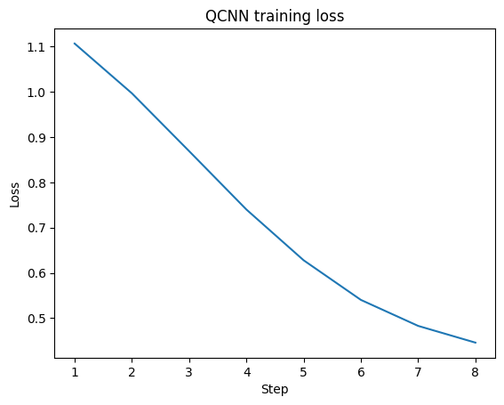
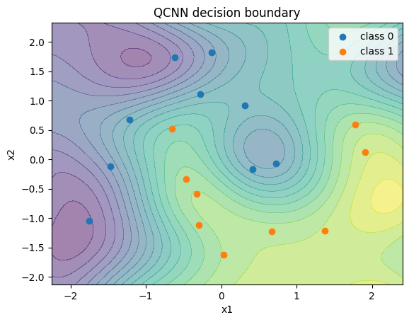

## Quantum Autoencoder

Notebook: `notebooks/tutorials/11-quantum-autoencoder.ipynb`

Result block 1:

```text
Train compression fidelity: 0.9729841780176779
Test compression fidelity: 0.971444977321234
Train reconstruction fidelity: 0.9729841780176779
Test reconstruction fidelity: 0.9714449773212341
Final loss: 0.027027868067930227
```
Result block 2:

```text
Parameter tensor shape: (2, 4, 2)
Latent qubits: 2
Trash qubits: 2
```
Result block 3:

```text
correlated
  train compression fidelity: 0.9725666481383045
  test compression fidelity: 0.9710059982389014
  test reconstruction fidelity: 0.9710059982389015
entangled
  train compression fidelity: 0.4378060715512072
  test compression fidelity: 0.4831713546984486
  test reconstruction fidelity: 0.48317135469844863
hybrid
  train compression fidelity: 0.7725086540592571
  test compression fidelity: 0.8327539703789598
  test reconstruction fidelity: 0.8327539703789596
```

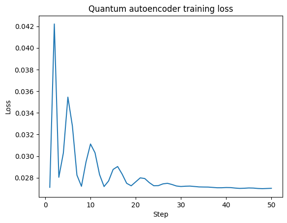

## Reproduce

Regenerate notebook result pages from existing executed notebook outputs:

```bash
python docs/pages/generate_results.py --skip-api-results
```

Execute notebooks first, then regenerate result pages:

```bash
python docs/pages/generate_results.py --skip-api-results --execute-notebooks
```
