# Benchmark Notebook Results

Executed outputs from benchmark notebooks in `notebooks/benchmarks/`. These compare QML workflows with classical baselines using deterministic seeds, confidence intervals, paired deltas, runtime summaries, and finite-shot sweeps.

## Environment

- Generated: stable
- Git commit: `stable`
- Python: `3.12.1`
- Package version: `0.2.14`
- Matplotlib backend: `Agg`

## Summary

| Notebook | Text result blocks | Plots |
| --- | ---: | ---: |
| [notebooks/benchmarks/01-classification-model-benchmark.ipynb](#classification-model-benchmark) | 2 | 3 |
| [notebooks/benchmarks/02-regression-model-benchmark.ipynb](#regression-model-benchmark) | 2 | 3 |
| [notebooks/benchmarks/03-quantum-kernel-family-benchmark.ipynb](#quantum-kernel-family-benchmark) | 2 | 2 |
| [notebooks/benchmarks/04-variational-model-capacity-benchmark.ipynb](#variational-model-capacity-benchmark) | 2 | 2 |
| [notebooks/benchmarks/05-finite-shot-benchmark.ipynb](#finite-shot-benchmark) | 2 | 2 |
| [notebooks/benchmarks/06-real-data-small-sample-benchmark.ipynb](#real-data-small-sample-benchmark) | 2 | 2 |
| [notebooks/benchmarks/07-noise-model-benchmark.ipynb](#noise-model-benchmark) | 3 | 2 |
| [notebooks/benchmarks/08-runtime-scaling-benchmark.ipynb](#runtime-scaling-benchmark) | 4 | 1 |

## Classification Model Benchmark

Notebook: `notebooks/benchmarks/01-classification-model-benchmark.ipynb`

Result block 1:

```text
Classification summary
+--------------------------+---------------+----------+-----------+----------+------------+--------+-------+------+
| model                    | test_accuracy | ci95_low | ci95_high | gap      | runtime_s  | params | depth | runs |
+--------------------------+---------------+----------+-----------+----------+------------+--------+-------+------+
| qcnn                     | 0.75          | 0.75     | 0.75      | 0.125    | 6.53325    | 38     | 24    | 1    |
| quantum_kernel           | 0.75          | 0.75     | 0.75      | 0.166667 | 0.892866   | 0      | 3     | 1    |
| logistic_regression      | 0.75          | 0.75     | 0.75      | 0.166667 | 0.00552011 |        |       | 1    |
| svm_classifier           | 0.75          | 0.75     | 0.75      | 0.166667 | 0.0045726  |        |       | 1    |
| random_forest_classifier | 0.75          | 0.75     | 0.75      | 0.25     | 0.0452248  |        |       | 1    |
| vqc                      | 0.625         | 0.625    | 0.625     | 0        | 0.869101   | 4      | 5     | 1    |
| quantum_reservoir        | 0.5           | 0.5      | 0.5       | 0.125    | 0.107451   | 0      | 2     | 1    |
+--------------------------+---------------+----------+-----------+----------+------------+--------+-------+------+

Paired deltas vs logistic_regression
+--------------------------+------------+------+--------+------+-------+
| model                    | mean_delta | wins | losses | ties | pairs |
+--------------------------+------------+------+--------+------+-------+
| vqc                      | -0.125     | 0    | 1      | 0    | 1     |
| qcnn                     | 0          | 0    | 0      | 1    | 1     |
| quantum_kernel           | 0          | 0    | 0      | 1    | 1     |
| quantum_reservoir        | -0.25      | 0    | 1      | 0    | 1     |
| logistic_regression      | 0          | 0    | 0      | 1    | 1     |
| svm_classifier           | 0          | 0    | 0      | 1    | 1     |
| random_forest_classifier | 0          | 0    | 0      | 1    | 1     |
+--------------------------+------------+------+--------+------+-------+

Best model
+------------------+---------------+
| Metric           | Value         |
+------------------+---------------+
| model            | qcnn          |
| metric           | test_accuracy |
| value            | 0.75          |
| higher_is_better | True          |
+------------------+---------------+
```
Result block 2:

```text
Classification dataset sweep
+---------+-------------------+---------------+----------+-----------+------------+------------+--------+-------+------+
| dataset | model             | test_accuracy | ci95_low | ci95_high | gap        | runtime_s  | params | depth | runs |
+---------+-------------------+---------------+----------+-----------+------------+------------+--------+-------+------+
| moons   | quantum_kernel    | 0.75          | 0.75     | 0.75      | 0.166667   | 0.931716   | 0      | 3     | 1    |
| moons   | svm_classifier    | 0.75          | 0.75     | 0.75      | 0.166667   | 0.00765863 |        |       | 1    |
| moons   | vqc               | 0.625         | 0.625    | 0.625     | 0          | 0.679553   | 4      | 5     | 1    |
| moons   | quantum_reservoir | 0.5           | 0.5      | 0.5       | 0.125      | 0.138952   | 0      | 2     | 1    |
| circles | quantum_kernel    | 0.875         | 0.875    | 0.875     | 0.125      | 0.830495   | 0      | 3     | 1    |
| circles | svm_classifier    | 0.875         | 0.875    | 0.875     | 0.125      | 0.00504418 |        |       | 1    |
| circles | vqc               | 0.5           | 0.5      | 0.5       | -0.208333  | 0.759714   | 4      | 5     | 1    |
| circles | quantum_reservoir | 0.5           | 0.5      | 0.5       | 0.291667   | 0.170294   | 0      | 2     | 1    |
| wine    | quantum_kernel    | 1             | 1        | 1         | -0.0416667 | 0.923827   | 0      | 3     | 1    |
| wine    | svm_classifier    | 1             | 1        | 1         | -0.0416667 | 0.0130524  |        |       | 1    |
| wine    | quantum_reservoir | 0.625         | 0.625    | 0.625     | 0.0833333  | 0.134928   | 0      | 2     | 1    |
| wine    | vqc               | 0.375         | 0.375    | 0.375     | 0.125      | 0.982362   | 4      | 5     | 1    |
+---------+-------------------+---------------+----------+-----------+------------+------------+--------+-------+------+
```

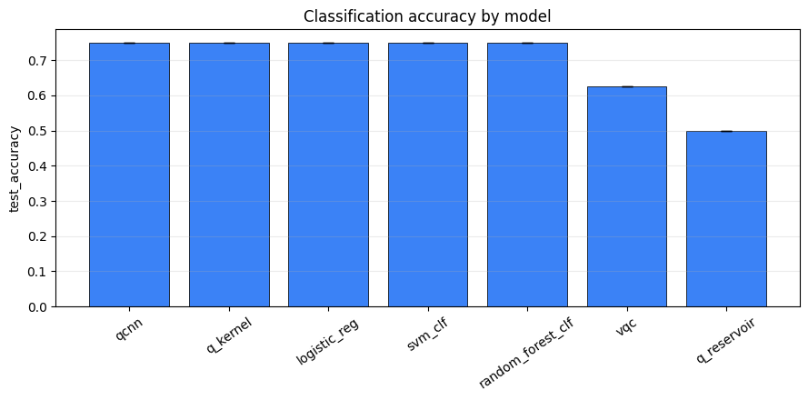
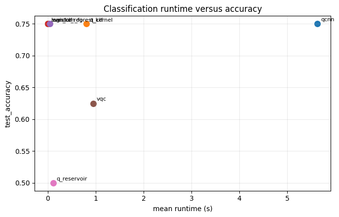
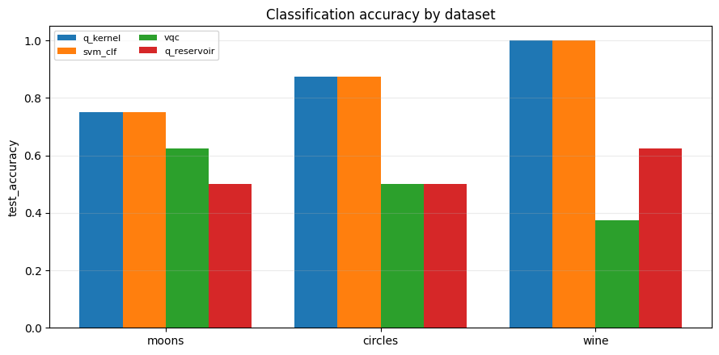

## Regression Model Benchmark

Notebook: `notebooks/benchmarks/02-regression-model-benchmark.ipynb`

Result block 1:

```text
Regression summary by MSE
+------------------------------------+-----------+-----------+-----------+------------+------------+--------+-------+------+
| model                              | test_mse  | ci95_low  | ci95_high | gap        | runtime_s  | params | depth | runs |
+------------------------------------+-----------+-----------+-----------+------------+------------+--------+-------+------+
| svr_regression                     | 0.0801907 | 0.0801907 | 0.0801907 | -0.0136897 | 0.00275484 |        |       | 1    |
| vqr                                | 0.122342  | 0.122342  | 0.122342  | -0.773642  | 0.881965   | 4      | 5     | 1    |
| kernel_ridge_regression            | 0.197459  | 0.197459  | 0.197459  | 0.0338305  | 0.00322244 |        |       | 1    |
| quantum_gaussian_process_regressor | 0.373078  | 0.373078  | 0.373078  | 0.11375    | 1.07821    | 0      | 3     | 1    |
| quantum_kernel_regressor           | 0.419824  | 0.419824  | 0.419824  | 0.0973739  | 1.1084     | 0      | 3     | 1    |
| ridge_regression                   | 0.622718  | 0.622718  | 0.622718  | 0.121189   | 0.00295959 |        |       | 1    |
| quantum_reservoir_regressor        | 0.986287  | 0.986287  | 0.986287  | 0.0713367  | 0.110311   | 0      | 2     | 1    |
+------------------------------------+-----------+-----------+-----------+------------+------------+--------+-------+------+

Regression summary by MAE
+------------------------------------+----------+----------+-----------+------------+------------+--------+-------+------+
| model                              | test_mae | ci95_low | ci95_high | gap        | runtime_s  | params | depth | runs |
+------------------------------------+----------+----------+-----------+------------+------------+--------+-------+------+
| svr_regression                     | 0.230482 | 0.230482 | 0.230482  | -0.0136897 | 0.00275484 |        |       | 1    |
| vqr                                | 0.300124 | 0.300124 | 0.300124  | -0.773642  | 0.881965   | 4      | 5     | 1    |
| kernel_ridge_regression            | 0.408842 | 0.408842 | 0.408842  | 0.0338305  | 0.00322244 |        |       | 1    |
| quantum_gaussian_process_regressor | 0.562695 | 0.562695 | 0.562695  | 0.11375    | 1.07821    | 0      | 3     | 1    |
| quantum_kernel_regressor           | 0.60704  | 0.60704  | 0.60704   | 0.0973739  | 1.1084     | 0      | 3     | 1    |
| ridge_regression                   | 0.705256 | 0.705256 | 0.705256  | 0.121189   | 0.00295959 |        |       | 1    |
| quantum_reservoir_regressor        | 0.837164 | 0.837164 | 0.837164  | 0.0713367  | 0.110311   | 0      | 2     | 1    |
+------------------------------------+----------+----------+-----------+------------+------------+--------+-------+------+

Paired MSE deltas vs svr_regression
+------------------------------------+------------+------+--------+------+-------+
| model                              | mean_delta | wins | losses | ties | pairs |
+------------------------------------+------------+------+--------+------+-------+
| vqr                                | 0.0421516  | 0    | 1      | 0    | 1     |
| quantum_kernel_regressor           | 0.339634   | 0    | 1      | 0    | 1     |
| quantum_gaussian_process_regressor | 0.292887   | 0    | 1      | 0    | 1     |
| quantum_reservoir_regressor        | 0.906096   | 0    | 1      | 0    | 1     |
| ridge_regression                   | 0.542528   | 0    | 1      | 0    | 1     |
| kernel_ridge_regression            | 0.117269   | 0    | 1      | 0    | 1     |
| svr_regression                     | 0          | 0    | 0      | 1    | 1     |
+------------------------------------+------------+------+--------+------+-------+

Best model
+------------------+----------------+
| Metric           | Value          |
+------------------+----------------+
| model            | svr_regression |
| metric           | test_mse       |
| value            | 0.0801907      |
| higher_is_better | False          |
+------------------+----------------+
```
Result block 2:

```text
Regression dataset sweep
+----------+-----------------------------+------------+------------+------------+------------+------------+--------+-------+------+
| dataset  | model                       | test_mse   | ci95_low   | ci95_high  | gap        | runtime_s  | params | depth | runs |
+----------+-----------------------------+------------+------------+------------+------------+------------+--------+-------+------+
| linear   | ridge_regression            | 0.00322048 | 0.00322048 | 0.00322048 | 0.00141887 | 0.00445475 |        |       | 1    |
| linear   | quantum_kernel_regressor    | 0.168163   | 0.168163   | 0.168163   | -0.0173032 | 0.778108   | 0      | 3     | 1    |
| linear   | vqr                         | 1.12147    | 1.12147    | 1.12147    | 0.0589046  | 1.21235    | 4      | 5     | 1    |
| linear   | quantum_reservoir_regressor | 1.29671    | 1.29671    | 1.29671    | 0.325749   | 0.107004   | 0      | 2     | 1    |
| sine     | vqr                         | 0.122342   | 0.122342   | 0.122342   | -0.773642  | 0.897557   | 4      | 5     | 1    |
| sine     | quantum_kernel_regressor    | 0.419824   | 0.419824   | 0.419824   | 0.0973739  | 1.02513    | 0      | 3     | 1    |
| sine     | ridge_regression            | 0.622718   | 0.622718   | 0.622718   | 0.121189   | 0.00439305 |        |       | 1    |
| sine     | quantum_reservoir_regressor | 0.986287   | 0.986287   | 0.986287   | 0.0713367  | 0.0975136  | 0      | 2     | 1    |
| diabetes | quantum_kernel_regressor    | 0.667531   | 0.667531   | 0.667531   | 0.0185848  | 0.790349   | 0      | 3     | 1    |
| diabetes | ridge_regression            | 0.677572   | 0.677572   | 0.677572   | -0.145698  | 0.00666374 |        |       | 1    |
| diabetes | vqr                         | 0.816185   | 0.816185   | 0.816185   | -0.726353  | 0.985049   | 4      | 5     | 1    |
| diabetes | quantum_reservoir_regressor | 0.886238   | 0.886238   | 0.886238   | 0.0638437  | 0.196492   | 0      | 2     | 1    |
+----------+-----------------------------+------------+------------+------------+------------+------------+--------+-------+------+
```

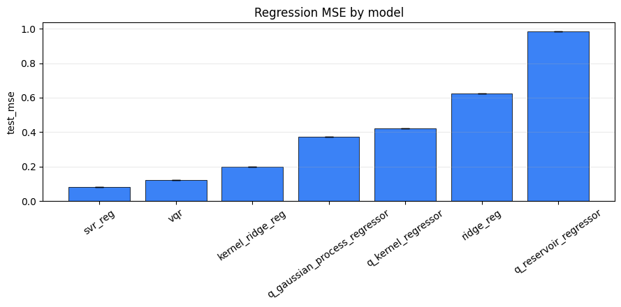
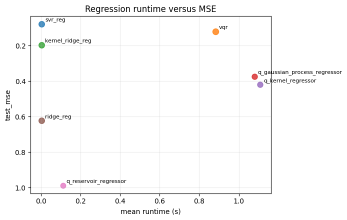
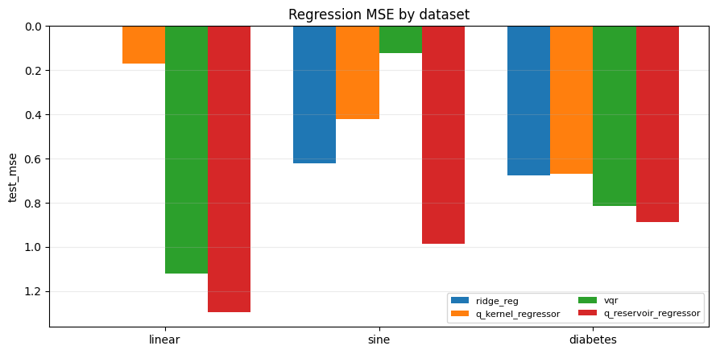

## Quantum Kernel Family Benchmark

Notebook: `notebooks/benchmarks/03-quantum-kernel-family-benchmark.ipynb`

Result block 1:

```text
Kernel-family benchmark summary
+---------+--------------------------+---------------+----------+-----------+----------+------------+
| dataset | model                    | test_accuracy | ci95_low | ci95_high | gap      | runtime_s  |
+---------+--------------------------+---------------+----------+-----------+----------+------------+
| moons   | quantum_kernel           | 0.75          | 0.75     | 0.75      | 0.166667 | 0.863331   |
| moons   | trainable_quantum_kernel | 0.75          | 0.75     | 0.75      | 0.166667 | 51.9044    |
| moons   | svm_classifier           | 0.75          | 0.75     | 0.75      | 0.166667 | 0.00341541 |
| moons   | knn_classifier           | 0.75          | 0.75     | 0.75      | 0.208333 | 0.00571792 |
| circles | quantum_kernel           | 0.875         | 0.875    | 0.875     | 0.125    | 0.831367   |
| circles | trainable_quantum_kernel | 0.875         | 0.875    | 0.875     | 0.125    | 51.4472    |
| circles | svm_classifier           | 0.875         | 0.875    | 0.875     | 0.125    | 0.00477611 |
| circles | knn_classifier           | 0.5           | 0.5      | 0.5       | 0.166667 | 0.00516245 |
+---------+--------------------------+---------------+----------+-----------+----------+------------+

Paired deltas vs best classical kernel-style baseline
+---------+----------------+--------------------------+------------+------+--------+-------+
| dataset | reference      | model                    | mean_delta | wins | losses | pairs |
+---------+----------------+--------------------------+------------+------+--------+-------+
| moons   | svm_classifier | quantum_kernel           | 0          | 0    | 0      | 1     |
| moons   | svm_classifier | trainable_quantum_kernel | 0          | 0    | 0      | 1     |
| moons   | svm_classifier | svm_classifier           | 0          | 0    | 0      | 1     |
| moons   | svm_classifier | knn_classifier           | 0          | 0    | 0      | 1     |
| circles | svm_classifier | quantum_kernel           | 0          | 0    | 0      | 1     |
| circles | svm_classifier | trainable_quantum_kernel | 0          | 0    | 0      | 1     |
| circles | svm_classifier | svm_classifier           | 0          | 0    | 0      | 1     |
| circles | svm_classifier | knn_classifier           | -0.375     | 0    | 1      | 1     |
+---------+----------------+--------------------------+------------+------+--------+-------+
```
Result block 2:

```text
Trainable quantum kernel diagnostics: moons
+---------+------+---------------+-----------------+-----------+
| dataset | seed | test_accuracy | final_alignment | runtime_s |
+---------+------+---------------+-----------------+-----------+
| moons   | 0    | 0.75          | 0.32394         | 51.9044   |
+---------+------+---------------+-----------------+-----------+

Trainable quantum kernel diagnostics: circles
+---------+------+---------------+-----------------+-----------+
| dataset | seed | test_accuracy | final_alignment | runtime_s |
+---------+------+---------------+-----------------+-----------+
| circles | 0    | 0.875         | 0.133107        | 51.4472   |
+---------+------+---------------+-----------------+-----------+
```

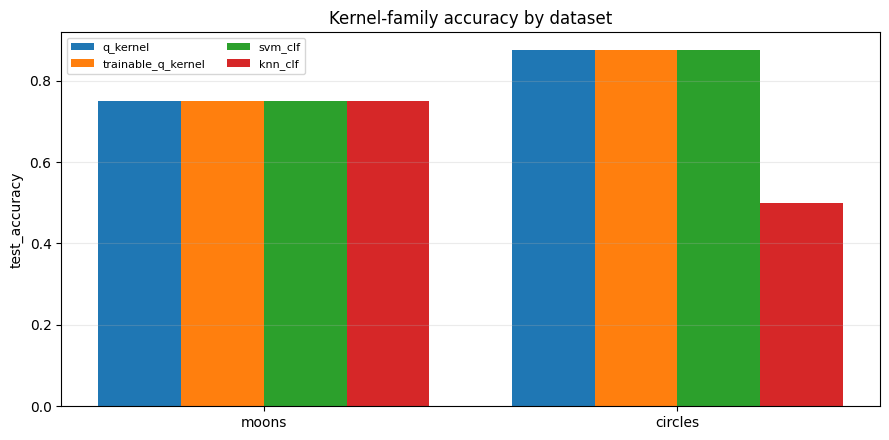
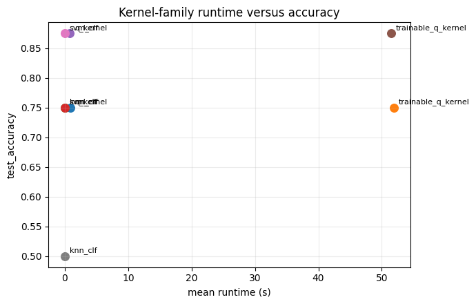

## Variational Model Capacity Benchmark

Notebook: `notebooks/benchmarks/04-variational-model-capacity-benchmark.ipynb`

Result block 1:

```text
Classification capacity summary
+---------------------+-----------------------------+---------------+-----------+------+
| model               | capacity                    | test_accuracy | runtime_s | runs |
+---------------------+-----------------------------+---------------+-----------+------+
| qcnn                | {'steps': 8}                | 0.875         | 10.8415   | 1    |
| logistic_regression | reference                   | 0.75          | 0.012237  | 1    |
| qcnn                | {'steps': 4}                | 0.625         | 5.71036   | 1    |
| vqc                 | {'n_layers': 1, 'steps': 4} | 0.375         | 0.756289  | 1    |
| vqc                 | {'n_layers': 2, 'steps': 4} | 0.375         | 1.50935   | 1    |
+---------------------+-----------------------------+---------------+-----------+------+
```
Result block 2:

```text
Regression capacity summary
+------------------+-----------------------------+----------+----------+------------+------+
| model            | capacity                    | test_mse | test_mae | runtime_s  | runs |
+------------------+-----------------------------+----------+----------+------------+------+
| vqr              | {'n_layers': 1, 'steps': 5} | 0.131641 | 0.307639 | 0.732672   | 1    |
| vqr              | {'n_layers': 2, 'steps': 5} | 0.161685 | 0.370644 | 1.542      | 1    |
| ridge_regression | reference                   | 0.634695 | 0.70884  | 0.00462633 | 1    |
+------------------+-----------------------------+----------+----------+------------+------+
```

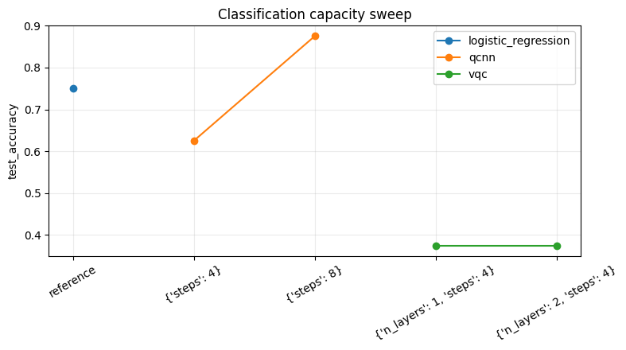
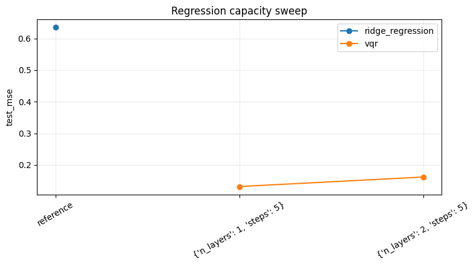

## Finite-Shot Benchmark

Notebook: `notebooks/benchmarks/05-finite-shot-benchmark.ipynb`

Result block 1:

```text
Classification finite-shot summary
+----------+-------------------+---------------+----------+-----------+--------------------+------------+----------------------------+
| shots    | model             | test_accuracy | ci95_low | ci95_high | generalization_gap | runtime_s  | accuracy_delta_vs_analytic |
+----------+-------------------+---------------+----------+-----------+--------------------+------------+----------------------------+
| analytic | vqc               | 0.166667      | 0.166667 | 0.166667  | 0.222222           | 0.773331   | 0                          |
| analytic | qcnn              | 0.833333      | 0.833333 | 0.833333  | -0.111111          | 4.33888    | 0                          |
| analytic | quantum_kernel    | 0.833333      | 0.833333 | 0.833333  | -0.0555556         | 0.477389   | 0                          |
| analytic | quantum_reservoir | 0.333333      | 0.333333 | 0.333333  | 0.444444           | 0.0839278  | 0                          |
| analytic | svm_classifier    | 1             | 1        | 1         | -0.166667          | 0.00424588 | 0                          |
| 64       | vqc               | 0.5           | 0.5      | 0.5       | 0.166667           | 1.56435    | 0.333333                   |
| 64       | qcnn              | 0.833333      | 0.833333 | 0.833333  | -0.277778          | 48.7621    | 0                          |
| 64       | quantum_kernel    | 0.833333      | 0.833333 | 0.833333  | -0.0555556         | 0.73402    | 0                          |
| 64       | quantum_reservoir | 0.333333      | 0.333333 | 0.333333  | 0.388889           | 0.126997   | 0                          |
| 64       | svm_classifier    | 1             | 1        | 1         | -0.166667          | 0.00407665 | 0                          |
| 128      | vqc               | 0.5           | 0.5      | 0.5       | 0.166667           | 1.36173    | 0.333333                   |
| 128      | qcnn              | 0.833333      | 0.833333 | 0.833333  | -0.277778          | 48.6335    | 0                          |
| 128      | quantum_kernel    | 0.833333      | 0.833333 | 0.833333  | -0.0555556         | 0.701925   | 0                          |
| 128      | quantum_reservoir | 0.333333      | 0.333333 | 0.333333  | 0.444444           | 0.128213   | 0                          |
| 128      | svm_classifier    | 1             | 1        | 1         | -0.166667          | 0.00432783 | 0                          |
| 512      | vqc               | 0.5           | 0.5      | 0.5       | 0.222222           | 1.21103    | 0.333333                   |
| 512      | qcnn              | 1             | 1        | 1         | -0.277778          | 49.9567    | 0.166667                   |
| 512      | quantum_kernel    | 0.833333      | 0.833333 | 0.833333  | -0.0555556         | 0.631688   | 0                          |
| 512      | quantum_reservoir | 0.333333      | 0.333333 | 0.333333  | 0.388889           | 0.18658    | 0                          |
| 512      | svm_classifier    | 1             | 1        | 1         | -0.166667          | 0.00436783 | 0                          |
+----------+-------------------+---------------+----------+-----------+--------------------+------------+----------------------------+
```
Result block 2:

```text
Regression finite-shot summary
+----------+------------------------------------+----------+----------+-----------+--------------------+------------+-----------------------+
| shots    | model                              | test_mse | ci95_low | ci95_high | generalization_gap | runtime_s  | mse_delta_vs_analytic |
+----------+------------------------------------+----------+----------+-----------+--------------------+------------+-----------------------+
| analytic | vqr                                | 0.665687 | 0.665687 | 0.665687  | -0.0945696         | 0.688634   | 0                     |
| analytic | quantum_kernel_regressor           | 0.618937 | 0.618937 | 0.618937  | 0.39149            | 0.474838   | 0                     |
| analytic | quantum_gaussian_process_regressor | 1.13144  | 1.13144  | 1.13144   | 1.06286            | 0.496159   | 0                     |
| analytic | quantum_reservoir_regressor        | 0.982325 | 0.982325 | 0.982325  | 0.100131           | 0.150744   | 0                     |
| analytic | ridge_regression                   | 0.65928  | 0.65928  | 0.65928   | 0.345539           | 0.00317971 | 0                     |
| 64       | vqr                                | 0.603867 | 0.603867 | 0.603867  | -0.122759          | 1.55517    | -0.0618199            |
| 64       | quantum_kernel_regressor           | 0.58976  | 0.58976  | 0.58976   | 0.368003           | 0.654571   | -0.0291769            |
| 64       | quantum_gaussian_process_regressor | 0.78001  | 0.78001  | 0.78001   | 0.646353           | 0.633054   | -0.35143              |
| 64       | quantum_reservoir_regressor        | 1.04479  | 1.04479  | 1.04479   | 0.177314           | 0.115762   | 0.0624619             |
| 64       | ridge_regression                   | 0.65928  | 0.65928  | 0.65928   | 0.345539           | 0.00259913 | 0                     |
| 128      | vqr                                | 0.664742 | 0.664742 | 0.664742  | -0.0626584         | 1.63253    | -0.000945064          |
| 128      | quantum_kernel_regressor           | 0.577133 | 0.577133 | 0.577133  | 0.379557           | 0.676923   | -0.0418044            |
| 128      | quantum_gaussian_process_regressor | 0.861045 | 0.861045 | 0.861045  | 0.816126           | 0.69549    | -0.270395             |
| 128      | quantum_reservoir_regressor        | 0.998827 | 0.998827 | 0.998827  | 0.119465           | 0.118647   | 0.016502              |
| 128      | ridge_regression                   | 0.65928  | 0.65928  | 0.65928   | 0.345539           | 0.00417196 | 0                     |
| 512      | vqr                                | 0.66036  | 0.66036  | 0.66036   | -0.0898559         | 1.52294    | -0.00532629           |
| 512      | quantum_kernel_regressor           | 0.575466 | 0.575466 | 0.575466  | 0.374851           | 0.678763   | -0.0434711            |
| 512      | quantum_gaussian_process_regressor | 0.83301  | 0.83301  | 0.83301   | 0.771806           | 0.705678   | -0.29843              |
| 512      | quantum_reservoir_regressor        | 0.945361 | 0.945361 | 0.945361  | 0.062365           | 0.114641   | -0.0369647            |
| 512      | ridge_regression                   | 0.65928  | 0.65928  | 0.65928   | 0.345539           | 0.00252898 | 0                     |
+----------+------------------------------------+----------+----------+-----------+--------------------+------------+-----------------------+
```

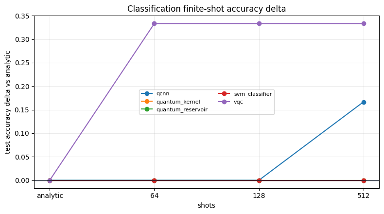
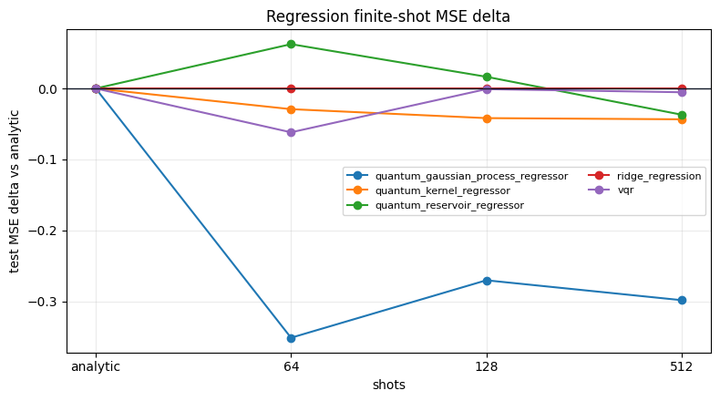

## Real-Data Small-Sample Benchmark

Notebook: `notebooks/benchmarks/06-real-data-small-sample-benchmark.ipynb`

Result block 1:

```text
Real-data classification summary
+---------------+---------------------+---------------+----------+-----------+------------+------------+
| dataset       | model               | test_accuracy | ci95_low | ci95_high | gap        | runtime_s  |
+---------------+---------------------+---------------+----------+-----------+------------+------------+
| breast_cancer | logistic_regression | 0.8           | 0.8      | 0.8       | 0.0666667  | 0.0089817  |
| breast_cancer | quantum_kernel      | 0.666667      | 0.666667 | 0.666667  | 0.2        | 3.01411    |
| breast_cancer | svm_classifier      | 0.666667      | 0.666667 | 0.666667  | 0.2        | 0.0115813  |
| breast_cancer | vqc                 | 0.533333      | 0.533333 | 0.533333  | -0.0666667 | 1.37249    |
| breast_cancer | quantum_reservoir   | 0.466667      | 0.466667 | 0.466667  | 0.177778   | 0.201987   |
| wine          | quantum_kernel      | 1             | 1        | 1         | -0.0888889 | 2.95942    |
| wine          | svm_classifier      | 1             | 1        | 1         | -0.0888889 | 0.00577888 |
| wine          | logistic_regression | 0.8           | 0.8      | 0.8       | 0.0888889  | 0.00486731 |
| wine          | vqc                 | 0.533333      | 0.533333 | 0.533333  | 0.111111   | 1.72089    |
| wine          | quantum_reservoir   | 0.533333      | 0.533333 | 0.533333  | 0.0222222  | 0.276563   |
+---------------+---------------------+---------------+----------+-----------+------------+------------+
```
Result block 2:

```text
Real-data regression summary
+----------+-----------------------------+----------+----------+----------+-----------+------------+
| dataset  | model                       | test_mse | test_mae | ci95_low | ci95_high | runtime_s  |
+----------+-----------------------------+----------+----------+----------+-----------+------------+
| diabetes | quantum_kernel_regressor    | 0.949192 | 0.85899  | 0.949192 | 0.949192  | 1.57759    |
| diabetes | ridge_regression            | 0.992731 | 0.913113 | 0.992731 | 0.992731  | 0.00436451 |
| diabetes | svr_regression              | 1.09356  | 0.963873 | 1.09356  | 1.09356   | 0.00504524 |
| diabetes | quantum_reservoir_regressor | 1.24796  | 1.03509  | 1.24796  | 1.24796   | 0.176436   |
| diabetes | vqr                         | 1.62663  | 1.01501  | 1.62663  | 1.62663   | 1.67081    |
+----------+-----------------------------+----------+----------+----------+-----------+------------+
```

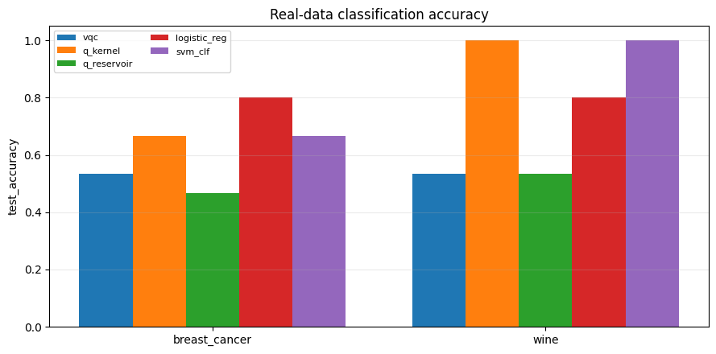
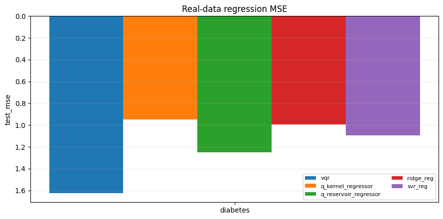

## Noise-Model Benchmark

Notebook: `notebooks/benchmarks/07-noise-model-benchmark.ipynb`

Result block 1:

```text
Classification noise-model summary
+------------------------+--------------------------------------------------------+----------------+---------------+----------+-----------+--------------------+------------+-----------------------------+
| noise_model            | noise_tag                                              | model          | test_accuracy | ci95_low | ci95_high | generalization_gap | runtime_s  | accuracy_delta_vs_noiseless |
+------------------------+--------------------------------------------------------+----------------+---------------+----------+-----------+--------------------+------------+-----------------------------+
| noiseless              | noiseless                                              | vqc            | 0.6           | 0.6      | 0.6       | 0                  | 0.854189   | 0                           |
| noiseless              | noiseless                                              | quantum_kernel | 0.6           | 0.6      | 0.6       | 0.266667           | 0.702677   | 0                           |
| noiseless              | noiseless                                              | svm_classifier | 0.8           | 0.8      | 0.8       | 0.0666667          | 0.0130219  | 0                           |
| depolarizing_0.02      | depolarizing0p02                                       | vqc            | 0.6           | 0.6      | 0.6       | 0                  | 1.5845     | 0                           |
| depolarizing_0.02      | depolarizing0p02                                       | quantum_kernel | 0.6           | 0.6      | 0.6       | 0.266667           | 1.13225    | 0                           |
| depolarizing_0.02      | depolarizing0p02                                       | svm_classifier | 0.8           | 0.8      | 0.8       | 0.0666667          | 0.00870595 | 0                           |
| amplitude_damping_0.02 | amplitudedamping0p02                                   | vqc            | 0.6           | 0.6      | 0.6       | 0                  | 1.27449    | 0                           |
| amplitude_damping_0.02 | amplitudedamping0p02                                   | quantum_kernel | 0.6           | 0.6      | 0.6       | 0.266667           | 1.25527    | 0                           |
| amplitude_damping_0.02 | amplitudedamping0p02                                   | svm_classifier | 0.8           | 0.8      | 0.8       | 0.0666667          | 0.00360445 | 0                           |
| readout_error_0.03     | readouterror0p03                                       | vqc            | 0.6           | 0.6      | 0.6       | 0                  | 0.596281   | 0                           |
| readout_error_0.03     | readouterror0p03                                       | quantum_kernel | 0.6           | 0.6      | 0.6       | 0.266667           | 0.840027   | 0                           |
| readout_error_0.03     | readouterror0p03                                       | svm_classifier | 0.8           | 0.8      | 0.8       | 0.0666667          | 0.00448502 | 0                           |
| combined_low           | depolarizing0p01_amplitudedamping0p01_readouterror0p02 | vqc            | 0.6           | 0.6      | 0.6       | 0                  | 0.815886   | 0                           |
| combined_low           | depolarizing0p01_amplitudedamping0p01_readouterror0p02 | quantum_kernel | 0.6           | 0.6      | 0.6       | 0.266667           | 0.923056   | 0                           |
| combined_low           | depolarizing0p01_amplitudedamping0p01_readouterror0p02 | svm_classifier | 0.8           | 0.8      | 0.8       | 0.0666667          | 0.00458748 | 0                           |
+------------------------+--------------------------------------------------------+----------------+---------------+----------+-----------+--------------------+------------+-----------------------------+
```
Result block 2:

```text
Regression noise-model summary
+------------------------+--------------------------------------------------------+--------------------------+----------+----------+-----------+--------------------+------------+------------------------+
| noise_model            | noise_tag                                              | model                    | test_mse | ci95_low | ci95_high | generalization_gap | runtime_s  | mse_delta_vs_noiseless |
+------------------------+--------------------------------------------------------+--------------------------+----------+----------+-----------+--------------------+------------+------------------------+
| noiseless              | noiseless                                              | vqr                      | 5.08599  | 5.08599  | 5.08599   | 4.35799            | 0.567244   | 0                      |
| noiseless              | noiseless                                              | quantum_kernel_regressor | 2.49846  | 2.49846  | 2.49846   | 2.225              | 0.391775   | 0                      |
| noiseless              | noiseless                                              | ridge_regression         | 2.10303  | 2.10303  | 2.10303   | 1.81081            | 0.00449462 | 0                      |
| depolarizing_0.02      | depolarizing0p02                                       | vqr                      | 5.02772  | 5.02772  | 5.02772   | 4.30715            | 1.00622    | -0.0582679             |
| depolarizing_0.02      | depolarizing0p02                                       | quantum_kernel_regressor | 2.50201  | 2.50201  | 2.50201   | 2.22621            | 0.841362   | 0.00355135             |
| depolarizing_0.02      | depolarizing0p02                                       | ridge_regression         | 2.10303  | 2.10303  | 2.10303   | 1.81081            | 0.00269852 | 0                      |
| amplitude_damping_0.02 | amplitudedamping0p02                                   | vqr                      | 5.11607  | 5.11607  | 5.11607   | 4.37205            | 0.784504   | 0.0300832              |
| amplitude_damping_0.02 | amplitudedamping0p02                                   | quantum_kernel_regressor | 2.495    | 2.495    | 2.495     | 2.22125            | 0.600997   | -0.00346088            |
| amplitude_damping_0.02 | amplitudedamping0p02                                   | ridge_regression         | 2.10303  | 2.10303  | 2.10303   | 1.81081            | 0.004028   | 0                      |
| readout_error_0.03     | readouterror0p03                                       | vqr                      | 4.95601  | 4.95601  | 4.95601   | 4.24358            | 0.863779   | -0.129981              |
| readout_error_0.03     | readouterror0p03                                       | quantum_kernel_regressor | 2.50679  | 2.50679  | 2.50679   | 2.22785            | 0.734005   | 0.008329               |
| readout_error_0.03     | readouterror0p03                                       | ridge_regression         | 2.10303  | 2.10303  | 2.10303   | 1.81081            | 0.00424434 | 0                      |
| combined_low           | depolarizing0p01_amplitudedamping0p01_readouterror0p02 | vqr                      | 4.98595  | 4.98595  | 4.98595   | 4.26417            | 0.889175   | -0.100039              |
| combined_low           | depolarizing0p01_amplitudedamping0p01_readouterror0p02 | quantum_kernel_regressor | 2.50417  | 2.50417  | 2.50417   | 2.22575            | 1.13066    | 0.00571259             |
| combined_low           | depolarizing0p01_amplitudedamping0p01_readouterror0p02 | ridge_regression         | 2.10303  | 2.10303  | 2.10303   | 1.81081            | 0.00422156 | 0                      |
+------------------------+--------------------------------------------------------+--------------------------+----------+----------+-----------+--------------------+------------+------------------------+
```
Result block 3:

```text
Noise benchmark validation
+---------------------+-----------------+--------------+--------+
| classification_rows | regression_rows | noise_models | passed |
+---------------------+-----------------+--------------+--------+
| 15                  | 15              | 5            | True   |
+---------------------+-----------------+--------------+--------+
```

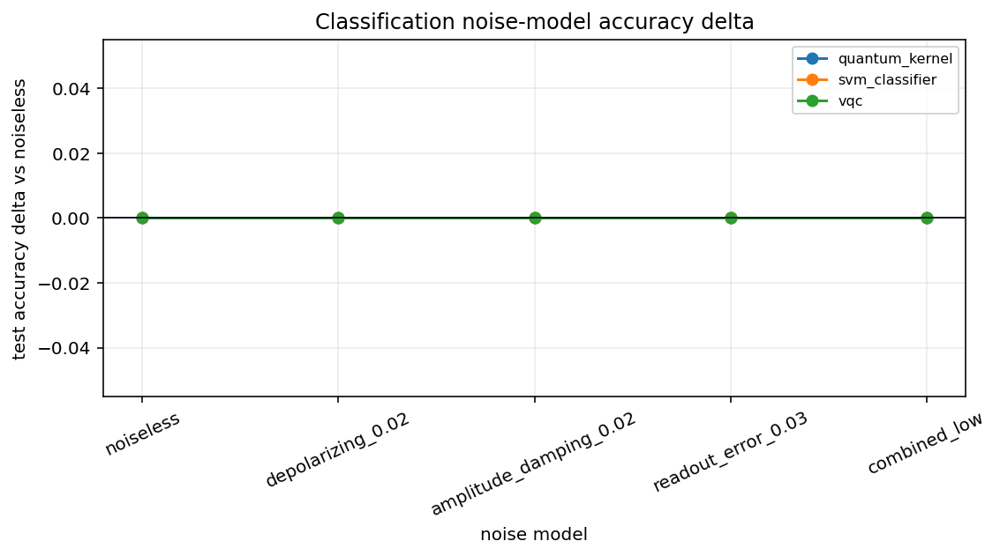
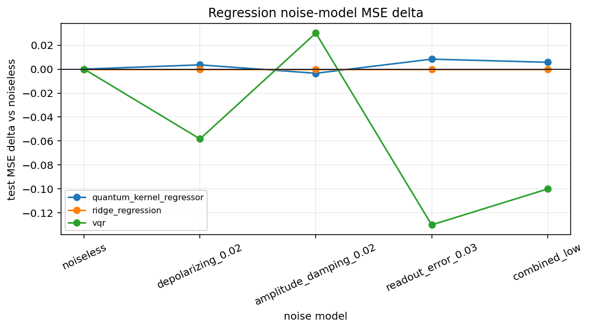

## Runtime Scaling Benchmark

Notebook: `notebooks/benchmarks/08-runtime-scaling-benchmark.ipynb`

Result block 1:

```text
Classification runtime scaling
+---------------------+-------------+----------+---------------------+----------------------+
| model               | sample_size | shots    | primary_metric_mean | runtime_seconds_mean |
+---------------------+-------------+----------+---------------------+----------------------+
| quantum_reservoir   | 24          | analytic | 0.3333              | 0.09198              |
| logistic_regression | 24          | analytic | 0.8333              | 0.005064             |
| quantum_reservoir   | 32          | analytic | 0.5                 | 0.1207               |
| logistic_regression | 32          | analytic | 0.75                | 0.004889             |
+---------------------+-------------+----------+---------------------+----------------------+
```
Result block 2:

```text
Regression runtime scaling
+-----------------------------+-------------+----------+---------------------+----------------------+
| model                       | sample_size | shots    | primary_metric_mean | runtime_seconds_mean |
+-----------------------------+-------------+----------+---------------------+----------------------+
| quantum_reservoir_regressor | 24          | analytic | 0.9823              | 0.09987              |
| ridge_regression            | 24          | analytic | 0.6593              | 0.002816             |
| quantum_reservoir_regressor | 32          | analytic | 1.003               | 0.0995               |
| ridge_regression            | 32          | analytic | 0.6347              | 0.002685             |
+-----------------------------+-------------+----------+---------------------+----------------------+
```
Result block 3:

```text
<IPython.core.display.Image object>
```
Result block 4:

```text
Validation
+-----------------------+-------------------------------------------------+
| Metric                | Value                                           |
+-----------------------+-------------------------------------------------+
| classification_rows   | 4                                               |
| regression_rows       | 4                                               |
| classification_models | [quantum_reservoir, logistic_regression]        |
| regression_models     | [quantum_reservoir_regressor, ridge_regression] |
| passed                | True                                            |
+-----------------------+-------------------------------------------------+
```

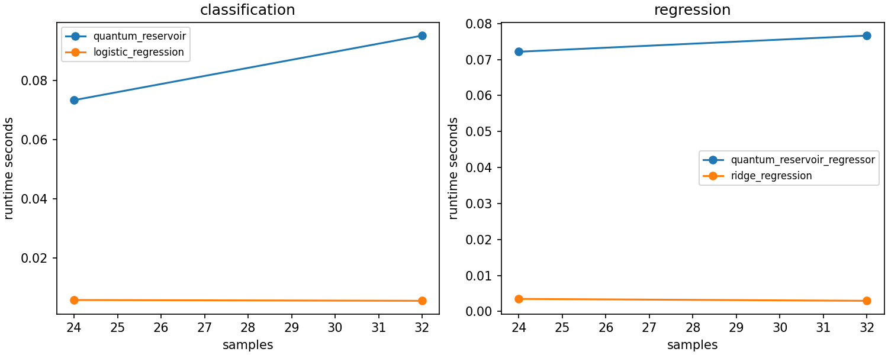

## Reproduce

Regenerate notebook result pages from committed notebook outputs:

```bash
python docs/pages/generate_results.py --skip-api-results
```
