# Real Example Notebook Results

Executed outputs from the domain-oriented notebooks in `notebooks/real_examples/`. These examples use small reproducible physics, mathematics, or dynamical-system tasks.

## Environment

- Generated: 2026-06-01 03:59:55 UTC
- Git commit: `15a5c1f`
- Python: `3.12.1`
- Package version: `0.2.9`
- Matplotlib backend: `Agg`

## Summary

| Notebook | Text result blocks | Plots |
| --- | ---: | ---: |
| [notebooks/real_examples/01-rabi-oscillation-parameter-inference.ipynb](#quantum-dynamics-rabi-oscillation-parameter-inference) | 3 | 2 |
| [notebooks/real_examples/02-ising-correlation-temperature-classifier.ipynb](#statistical-physics-ising-temperature-classification) | 3 | 2 |
| [notebooks/real_examples/03-lorenz-regime-classifier.ipynb](#nonlinear-dynamics-lorenz-regime-classification) | 3 | 2 |
| [notebooks/real_examples/04-condensed-matter-tfim-phase-classifier.ipynb](#condensed-matter-tfim-phase-classification) | 3 | 2 |
| [notebooks/real_examples/05-pendulum-trajectory-surrogate.ipynb](#dynamical-systems-pendulum-trajectory-surrogate) | 3 | 2 |
| [notebooks/real_examples/06-damped-oscillator-parameter-inference.ipynb](#inverse-problems-damped-oscillator-parameter-inference) | 3 | 2 |
| [notebooks/real_examples/07-tfim-hamiltonian-parameter-inference.ipynb](#condensed-matter-tfim-hamiltonian-parameter-inference) | 3 | 2 |
| [notebooks/real_examples/08-quantum-kernel-phase-discovery.ipynb](#condensed-matter-quantum-kernel-phase-discovery) | 3 | 2 |
| [notebooks/real_examples/09-potential-energy-curve-interpolation.ipynb](#molecular-physics-potential-energy-curve-interpolation) | 3 | 2 |
| [notebooks/real_examples/10-lorenz-quantum-reservoir-regime-classifier.ipynb](#dynamical-systems-lorenz-quantum-reservoir-regime-classification) | 3 | 2 |
| [notebooks/real_examples/11-noisy-oscillator-quantum-reservoir-inference.ipynb](#dynamical-systems-noisy-oscillator-quantum-reservoir-inference) | 3 | 2 |
| [notebooks/real_examples/12-heat-equation-diffusivity-inference.ipynb](#mathematical-physics-heat-equation-diffusivity-inference) | 3 | 2 |
| [notebooks/real_examples/13-kepler-orbit-regime-classifier.ipynb](#celestial-mechanics-kepler-orbit-regime-classification) | 3 | 2 |
| [notebooks/real_examples/14-vibrating-membrane-eigenfrequency-surrogate.ipynb](#mathematical-physics-vibrating-membrane-eigenfrequency-surrogate) | 3 | 2 |
| [notebooks/real_examples/15-arrhenius-reaction-activation-energy-inference.ipynb](#chemical-physics-arrhenius-activation-energy-inference) | 3 | 2 |
| [notebooks/real_examples/16-wave-equation-boundary-condition-classifier.ipynb](#mathematical-physics-wave-equation-boundary-condition-classification) | 3 | 2 |
| [notebooks/real_examples/17-optical-diffraction-anomaly-detection.ipynb](#optics-diffraction-pattern-anomaly-classification) | 3 | 2 |

## Quantum Dynamics: Rabi Oscillation Parameter Inference

Notebook: `notebooks/real_examples/01-rabi-oscillation-parameter-inference.ipynb`

Result block 1:

```text
Dataset
+-------------------+---------------------+
| Metric            | Value               |
+-------------------+---------------------+
| Samples           | 58                  |
| feature_shape     | [58, 3]             |
| Measurement times | [0.45, 0.95, 1.55]  |
| Omega range       | [0.721799, 2.38716] |
+-------------------+---------------------+
```
Result block 2:

```text
Results
+-------------------+------------+
| Metric            | Value      |
+-------------------+------------+
| Quantum omega MAE | 0.0393237  |
| Quantum omega MSE | 0.00319466 |
| Ridge omega MAE   | 0.0273694  |
| Initial loss      | 0.580552   |
| Final loss        | 0.00697781 |
| Loss steps        | 72         |
+-------------------+------------+
```
Result block 3:

```text
Validation
Dataset
+---------------+-----------------------------------------+
| Metric        | Value                                   |
+---------------+-----------------------------------------+
| Problem       | rabi_frequency_inference                |
| Features      | [P_e(t=0.45), P_e(t=0.95), P_e(t=1.55)] |
| Target        | rabi_frequency_omega                    |
| Train samples | 40                                      |
| Test samples  | 18                                      |
+---------------+-----------------------------------------+

Results
+-------------------+------------+
| Metric            | Value      |
+-------------------+------------+
| Quantum omega MAE | 0.0393237  |
| Quantum omega MSE | 0.00319466 |
| Ridge omega MAE   | 0.0273694  |
| Initial loss      | 0.580552   |
| Final loss        | 0.00697781 |
| Loss steps        | 72         |
+-------------------+------------+

Sample recoveries
1. Actual Omega: 1.999511, Quantum Omega: 2.027799, Ridge Omega: 1.981000
2. Actual Omega: 2.296350, Quantum Omega: 2.222178, Ridge Omega: 2.256309
3. Actual Omega: 1.474035, Quantum Omega: 1.486740, Ridge Omega: 1.458339
4. Actual Omega: 1.918194, Quantum Omega: 1.940107, Ridge Omega: 1.933709
5. Actual Omega: 1.762004, Quantum Omega: 1.732852, Ridge Omega: 1.756742
6. Actual Omega: 1.762079, Quantum Omega: 1.713610, Ridge Omega: 1.772137

Interpretation
The quantum inverse model trained successfully and recovers Rabi frequency within the validation tolerance.
The baseline is included as a sanity check; this validates package usage rather than quantum advantage.

Passed: True
```

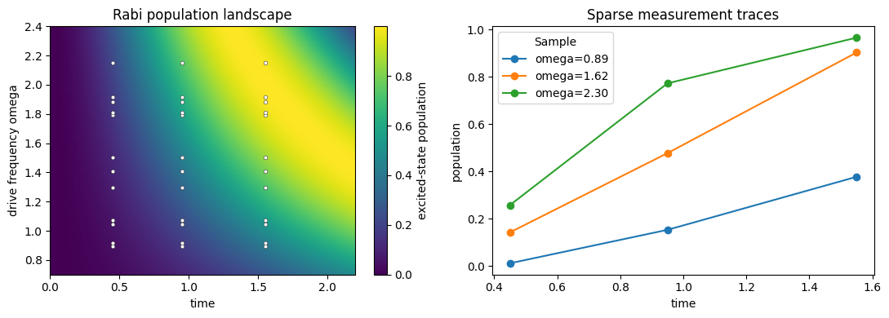
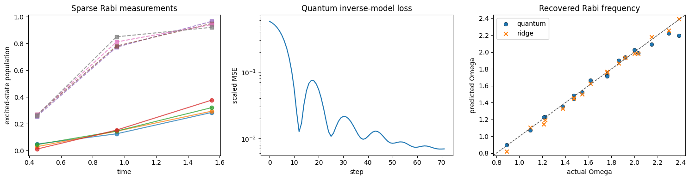

## Statistical Physics: Ising Temperature Classification

Notebook: `notebooks/real_examples/02-ising-correlation-temperature-classifier.ipynb`

Result block 1:

```text
Dataset
+-------------------+--------------+
| Metric            | Value        |
+-------------------+--------------+
| Samples           | 48           |
| feature_shape     | [48, 3]      |
| Labels            | [24, 24]     |
| Temperature range | [1.35, 3.45] |
+-------------------+--------------+
```
Result block 2:

```text
Results
+-------------------------+------------------+
| Metric                  | Value            |
+-------------------------+------------------+
| Quantum kernel accuracy | 0.933333         |
| Logistic accuracy       | 0.933333         |
| Confusion matrix        | [[8, 0], [1, 6]] |
| Kernel train shape      | [33, 33]         |
| Kernel diagonal minimum | 1                |
| Kernel symmetry error   | 6.66134e-16      |
+-------------------------+------------------+
```
Result block 3:

```text
Validation
Dataset
+-------------------+--------------------------------------------------------------------------------------------------------+
| Metric            | Value                                                                                                  |
+-------------------+--------------------------------------------------------------------------------------------------------+
| Problem           | ising_temperature_regime_classification                                                                |
| Lattice size      | 8                                                                                                      |
| Samples           | 48                                                                                                     |
| Feature names     | [absolute_magnetization, nearest_neighbor_correlation, energy_density]                                 |
| Test temperatures | [1.959, 1.685, 3.137, 2.05, 2.589, 3.333, 1.654, 3.254, 3.215, 1.533, 2.98, 1.837, 1.411, 3.45, 1.776] |
| Test labels       | [0, 0, 1, 0, 1, 1, 0, 1, 1, 0, 1, 0, 0, 1, 0]                                                          |
| Test predictions  | [0, 0, 1, 0, 1, 1, 0, 1, 0, 0, 1, 0, 0, 1, 0]                                                          |
+-------------------+--------------------------------------------------------------------------------------------------------+

Results
+-------------------------+------------------+
| Metric                  | Value            |
+-------------------------+------------------+
| Quantum kernel accuracy | 0.933333         |
| Logistic accuracy       | 0.933333         |
| Confusion matrix        | [[8, 0], [1, 6]] |
| Kernel train shape      | [33, 33]         |
| Kernel diagonal minimum | 1                |
| Kernel symmetry error   | 6.66134e-16      |
+-------------------------+------------------+

Interpretation
The Ising features separate low- and high-temperature regimes for this small Monte Carlo dataset.
The quantum kernel and logistic baseline are sanity-checked side by side; this validates workflow correctness, not quantum advantage.

Passed: True
```

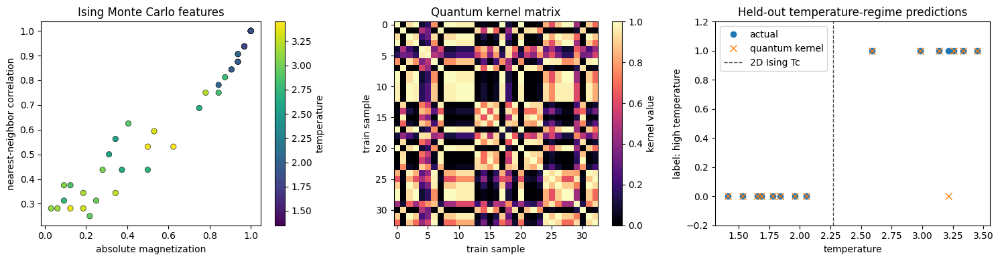


## Nonlinear Dynamics: Lorenz Regime Classification

Notebook: `notebooks/real_examples/03-lorenz-regime-classifier.ipynb`

Result block 1:

```text
Dataset
+---------------+----------+
| Metric        | Value    |
+---------------+----------+
| Samples       | 44       |
| feature_shape | [44, 3]  |
| Labels        | [22, 22] |
| Rho range     | [16, 38] |
+---------------+----------+
```
Result block 2:

```text
Results
+-------------------------+------------------+
| Metric                  | Value            |
+-------------------------+------------------+
| Quantum kernel accuracy | 1                |
| Logistic accuracy       | 1                |
| Confusion matrix        | [[7, 0], [0, 7]] |
| Kernel train shape      | [30, 30]         |
| Kernel diagonal minimum | 1                |
| Kernel symmetry error   | 6.66134e-16      |
+-------------------------+------------------+
```
Result block 3:

```text
Validation
Dataset
+------------------+---------------------------------------------------------------------------------------------------------+
| Metric           | Value                                                                                                   |
+------------------+---------------------------------------------------------------------------------------------------------+
| Problem          | lorenz_parameter_regime_classification                                                                  |
| Samples          | 44                                                                                                      |
| Feature names    | [mean_tail_z, std_tail_x, mean_abs_dx_tail]                                                             |
| Test rho values  | [16.571, 16, 19.429, 35.619, 38, 36.095, 16.286, 21.714, 37.048, 33.238, 28.952, 34.19, 16.857, 20.571] |
| Test labels      | [0, 0, 0, 1, 1, 1, 0, 0, 1, 1, 1, 1, 0, 0]                                                              |
| Test predictions | [0, 0, 0, 1, 1, 1, 0, 0, 1, 1, 1, 1, 0, 0]                                                              |
+------------------+---------------------------------------------------------------------------------------------------------+

Results
+-------------------------+------------------+
| Metric                  | Value            |
+-------------------------+------------------+
| Quantum kernel accuracy | 1                |
| Logistic accuracy       | 1                |
| Confusion matrix        | [[7, 0], [0, 7]] |
| Kernel train shape      | [30, 30]         |
| Kernel diagonal minimum | 1                |
| Kernel symmetry error   | 6.66134e-16      |
+-------------------------+------------------+

Interpretation
The Lorenz summary features distinguish the two chosen parameter regimes for this reproducible simulator.
The quantum kernel and logistic baseline are both sanity checks; this validates package usage rather than quantum advantage.

Passed: True
```

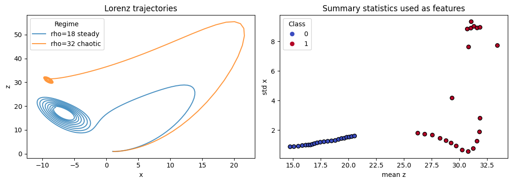
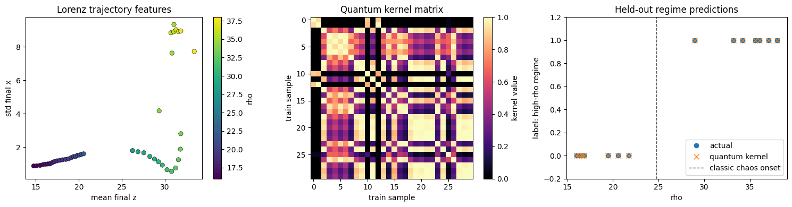

## Condensed Matter: TFIM Phase Classification

Notebook: `notebooks/real_examples/04-condensed-matter-tfim-phase-classifier.ipynb`

Result block 1:

```text
Dataset
+---------------+----------+
| Metric        | Value    |
+---------------+----------+
| Samples       | 48       |
| feature_shape | [48, 2]  |
| Labels        | [24, 24] |
+---------------+----------+
```
Result block 2:

```text
Results
+-------------------------+-------------+
| Metric                  | Value       |
+-------------------------+-------------+
| Quantum kernel accuracy | 1           |
| Logistic accuracy       | 1           |
| Kernel train shape      | [33, 33]    |
| Kernel diagonal minimum | 1           |
| Kernel symmetry error   | 4.44089e-16 |
+-------------------------+-------------+
```
Result block 3:

```text
Validation
Dataset
+------------------+----------------------------------------------------------------------------------------------------------+
| Metric           | Value                                                                                                    |
+------------------+----------------------------------------------------------------------------------------------------------+
| Problem          | finite_size_tfim_phase_classification                                                                    |
| N spins          | 4                                                                                                        |
| Samples          | 48                                                                                                       |
| Feature names    | [nearest_neighbor_zz_correlation, transverse_x_magnetization]                                            |
| Test fields      | [0.473, 1.463, 1.686, 0.697, 0.952, 0.346, 1.207, 0.378, 1.176, 1.527, 1.303, 0.505, 1.08, 1.016, 0.856] |
| Test labels      | [0, 1, 1, 0, 0, 0, 1, 0, 1, 1, 1, 0, 1, 1, 0]                                                            |
| Test predictions | [0, 1, 1, 0, 0, 0, 1, 0, 1, 1, 1, 0, 1, 1, 0]                                                            |
+------------------+----------------------------------------------------------------------------------------------------------+

Results
+-------------------------+-------------+
| Metric                  | Value       |
+-------------------------+-------------+
| Quantum kernel accuracy | 1           |
| Logistic accuracy       | 1           |
| Kernel train shape      | [33, 33]    |
| Kernel diagonal minimum | 1           |
| Kernel symmetry error   | 4.44089e-16 |
+-------------------------+-------------+

Interpretation
The TFIM feature set is cleanly separable in this finite-size example.
Both the quantum kernel model and the logistic baseline solve the held-out split perfectly, so this validates the workflow rather than demonstrating quantum advantage.

Passed: True
```


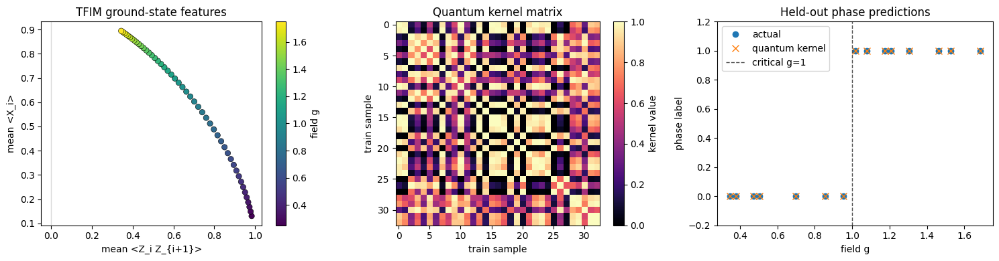

## Dynamical Systems: Pendulum Trajectory Surrogate

Notebook: `notebooks/real_examples/05-pendulum-trajectory-surrogate.ipynb`

Result block 1:

```text
Dataset
+---------------+----------------------+
| Metric        | Value                |
+---------------+----------------------+
| Samples       | 54                   |
| feature_shape | [54, 3]              |
| Target range  | [-0.57019, 0.562638] |
+---------------+----------------------+
```
Result block 2:

```text
Results
+------------------+-----------+
| Metric           | Value     |
+------------------+-----------+
| Quantum test MAE | 0.241666  |
| Quantum test MSE | 0.0977921 |
| Ridge test MAE   | 0.261172  |
| Initial loss     | 0.557283  |
| Final loss       | 0.0745353 |
| Loss steps       | 75        |
+------------------+-----------+
```
Result block 3:

```text
Validation
Dataset
+---------------+-------------------------------------------+
| Metric        | Value                                     |
+---------------+-------------------------------------------+
| Problem       | small_angle_pendulum_trajectory_surrogate |
| Features      | [theta0, omega0, time]                    |
| Target        | theta_at_time                             |
| Train samples | 37                                        |
| Test samples  | 17                                        |
+---------------+-------------------------------------------+

Results
+------------------+-----------+
| Metric           | Value     |
+------------------+-----------+
| Quantum test MAE | 0.241666  |
| Quantum test MSE | 0.0977921 |
| Ridge test MAE   | 0.261172  |
| Initial loss     | 0.557283  |
| Final loss       | 0.0745353 |
| Loss steps       | 75        |
+------------------+-----------+

Sample predictions
1. Actual: -0.340563, Quantum: -0.148739, Ridge: -0.148951
2. Actual: 0.295556, Quantum: 0.136990, Ridge: -0.018507
3. Actual: -0.075147, Quantum: -0.212564, Ridge: -0.145427
4. Actual: -0.244626, Quantum: 0.147142, Ridge: 0.100026
5. Actual: 0.392050, Quantum: 0.164307, Ridge: 0.110848
6. Actual: 0.036099, Quantum: 0.153176, Ridge: 0.111547

Interpretation
The quantum regressor trained successfully and reduced the optimization loss.
The held-out error is reasonable for a compact illustrative surrogate, but individual predictions can still be visibly imperfect.
The ridge baseline is included as a sanity benchmark; no quantum advantage is claimed.

Passed: True
```


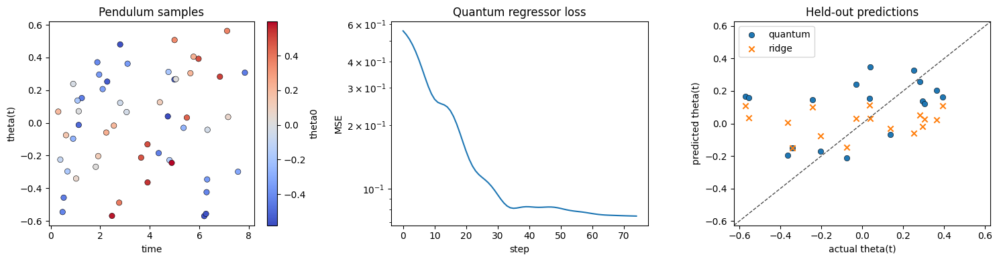

## Inverse Problems: Damped Oscillator Parameter Inference

Notebook: `notebooks/real_examples/06-damped-oscillator-parameter-inference.ipynb`

Result block 1:

```text
Dataset
+---------------+-----------------------+
| Metric        | Value                 |
+---------------+-----------------------+
| Samples       | 60                    |
| feature_shape | [60, 2]               |
| Gamma range   | [0.0702778, 0.574796] |
+---------------+-----------------------+
```
Result block 2:

```text
Results
+-------------------+-----------+
| Metric            | Value     |
+-------------------+-----------+
| Quantum gamma MAE | 0.0562714 |
| Ridge gamma MAE   | 0.0177185 |
| Initial loss      | 0.829008  |
| Final loss        | 0.0328188 |
| Loss steps        | 85        |
+-------------------+-----------+
```
Result block 3:

```text
Validation
Dataset
+---------------+-------------------------------------+
| Metric        | Value                               |
+---------------+-------------------------------------+
| Problem       | damped_oscillator_damping_inference |
| Features      | [x(t=0.7), x(t=1.4)]                |
| Target        | damping_gamma                       |
| Train samples | 42                                  |
| Test samples  | 18                                  |
+---------------+-------------------------------------+

Results
+-------------------+-----------+
| Metric            | Value     |
+-------------------+-----------+
| Quantum gamma MAE | 0.0562714 |
| Ridge gamma MAE   | 0.0177185 |
| Initial loss      | 0.829008  |
| Final loss        | 0.0328188 |
| Loss steps        | 85        |
+-------------------+-----------+

Sample recoveries
1. Actual gamma: 0.405297, Quantum gamma: 0.502452, Ridge gamma: 0.415919
2. Actual gamma: 0.299665, Quantum gamma: 0.396080, Ridge gamma: 0.318860
3. Actual gamma: 0.085770, Quantum gamma: 0.130895, Ridge gamma: 0.094191
4. Actual gamma: 0.442487, Quantum gamma: 0.448133, Ridge gamma: 0.447158
5. Actual gamma: 0.142181, Quantum gamma: 0.133497, Ridge gamma: 0.155010
6. Actual gamma: 0.477434, Quantum gamma: 0.514308, Ridge gamma: 0.466378

Interpretation
The quantum inverse model trained successfully and recovers damping coefficients within the validation tolerance.
The ridge baseline is stronger on this simple inverse problem, so this validates package usage rather than quantum advantage.

Passed: True
```

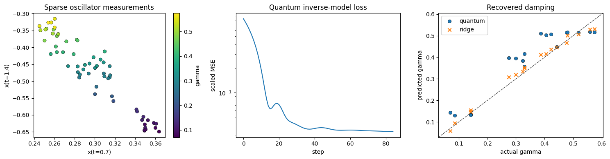


## Condensed Matter: TFIM Hamiltonian Parameter Inference

Notebook: `notebooks/real_examples/07-tfim-hamiltonian-parameter-inference.ipynb`

Result block 1:

```text
Dataset
+----------+---------------------------------+
| Metric   | Value                           |
+----------+---------------------------------+
| Problem  | TFIM transverse-field inference |
| Samples  | 24                              |
| Features | [<Z>, <X>, <ZZ>, E0/N]          |
| Target   | transverse field h              |
+----------+---------------------------------+
```
Result block 2:

```text
Results
+-------------------------+-----------+
| Metric                  | Value     |
+-------------------------+-----------+
| Trainable kernel h MAE  | 0.0483953 |
| Quantum GPR h MAE       | 0.147426  |
| Ridge h MAE             | 0.0103647 |
| Kernel-target alignment | 0.466965  |
+-------------------------+-----------+
```
Result block 3:

```text
Validation
Dataset
+---------------+---------------------------------+
| Metric        | Value                           |
+---------------+---------------------------------+
| problem       | tfim_transverse_field_inference |
| n_train       | 16                              |
| n_test        | 8                               |
| feature_count | 4                               |
+---------------+---------------------------------+

Results
+-----------------------------+-----------+
| Metric                      | Value     |
+-----------------------------+-----------+
| trainable_kernel_h_mae      | 0.0483953 |
| quantum_gpr_h_mae           | 0.147426  |
| ridge_h_mae                 | 0.0103647 |
| trainable_kernel_alignment  | 0.466965  |
| trainable_kernel_loss_final | -0.466965 |
+-----------------------------+-----------+

Sample predictions
+----------+--------------------+---------------+
| actual_h | trainable_kernel_h | quantum_gpr_h |
+----------+--------------------+---------------+
| 1.19783  | 1.17612            | 1.14429       |
| 0.480435 | 0.488462           | 0.481546      |
| 1.4587   | 1.45176            | 1.44352       |
| 1.85     | 1.80081            | 1.61504       |
+----------+--------------------+---------------+

Passed
+--------+-------+
| Metric | Value |
+--------+-------+
| passed | True  |
+--------+-------+
```

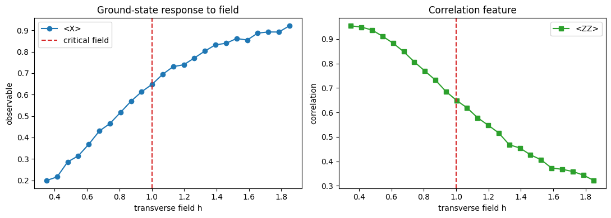
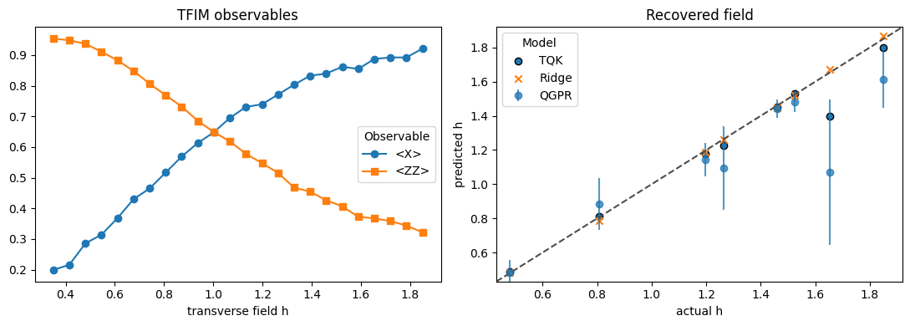

## Condensed Matter: Quantum Kernel Phase Discovery

Notebook: `notebooks/real_examples/08-quantum-kernel-phase-discovery.ipynb`

Result block 1:

```text
Dataset
+----------+-----------------------------------------+
| Metric   | Value                                   |
+----------+-----------------------------------------+
| Problem  | TFIM phase discovery/classification     |
| Samples  | 36                                      |
| Classes  | {0: 'ferromagnetic', 1: 'paramagnetic'} |
| Features | [<Z>, <X>, <ZZ>, E0/N]                  |
+----------+-----------------------------------------+
```
Result block 2:

```text
Results
+--------------------------+--------------------+
| Metric                   | Value              |
+--------------------------+--------------------+
| Quantum kernel accuracy  | 1                  |
| One-class phase accuracy | 0.727273           |
| Logistic accuracy        | 1                  |
| Kernel PCA eigenvalues   | [4.69121, 3.03512] |
+--------------------------+--------------------+
```
Result block 3:

```text
Validation
Dataset
+---------------+----------------------+
| Metric        | Value                |
+---------------+----------------------+
| problem       | tfim_phase_discovery |
| n_train       | 25                   |
| n_test        | 11                   |
| feature_count | 4                    |
+---------------+----------------------+

Results
+--------------------------+--------------------+
| Metric                   | Value              |
+--------------------------+--------------------+
| quantum_kernel_accuracy  | 1                  |
| one_class_phase_accuracy | 0.727273           |
| logistic_accuracy        | 1                  |
| kpca_eigenvalues         | [4.69121, 3.03512] |
+--------------------------+--------------------+

Sample predictions
+----------+--------+--------+-----------+
| h        | actual | kernel | one_class |
+----------+--------+--------+-----------+
| 0.709562 | 0      | 0      | 0         |
| 0.525813 | 0      | 0      | 0         |
| 0.387803 | 0      | 0      | 1         |
| 0.707049 | 0      | 0      | 0         |
| 1.64825  | 1      | 1      | 1         |
+----------+--------+--------+-----------+

Passed
+--------+-------+
| Metric | Value |
+--------+-------+
| passed | True  |
+--------+-------+
```


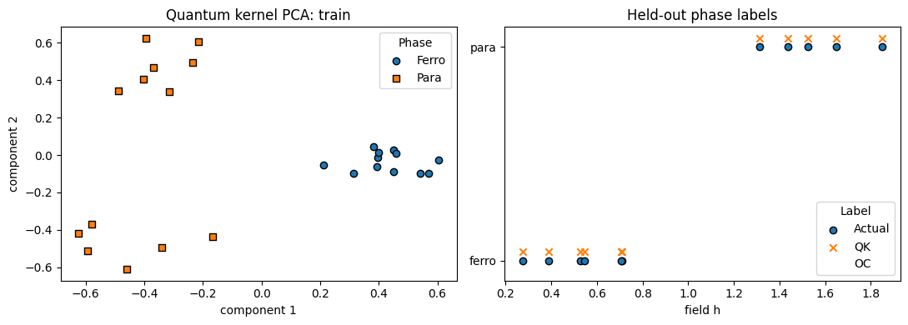

## Molecular Physics: Potential Energy Curve Interpolation

Notebook: `notebooks/real_examples/09-potential-energy-curve-interpolation.ipynb`

Result block 1:

```text
Dataset
+-----------------+-------------------------------+
| Metric          | Value                         |
+-----------------+-------------------------------+
| Problem         | Morse potential interpolation |
| Training points | 18                            |
| Held-out points | 24                            |
| Features        | [bond length r, r^2]          |
| Target          | potential energy              |
+-----------------+-------------------------------+
```
Result block 2:

```text
Results
+---------------------------------+-----------+
| Metric                          | Value     |
+---------------------------------+-----------+
| Quantum GPR energy MAE          | 0.0221625 |
| Quantum kernel ridge energy MAE | 0.073289  |
| Ridge energy MAE                | 0.572759  |
+---------------------------------+-----------+
```
Result block 3:

```text
Validation
Dataset
+---------+-------------------------------+
| Metric  | Value                         |
+---------+-------------------------------+
| problem | morse_potential_interpolation |
| n_train | 18                            |
| n_test  | 24                            |
+---------+-------------------------------+

Results
+---------------------------------+-------------+
| Metric                          | Value       |
+---------------------------------+-------------+
| quantum_gpr_energy_mae          | 0.0221625   |
| quantum_kernel_ridge_energy_mae | 0.073289    |
| ridge_energy_mae                | 0.572759    |
| quantum_gpr_energy_mse          | 0.000778001 |
+---------------------------------+-------------+

Sample predictions
+----------+---------------+--------------------+
| r        | actual_energy | quantum_gpr_energy |
+----------+---------------+--------------------+
| 0.79878  | -0.0330634    | 0.0471411          |
| 0.896341 | -1.82574      | -1.78565           |
| 0.945122 | -2.50641      | -2.50454           |
| 0.993902 | -3.06713      | -3.0818            |
| 1.09146  | -3.88831      | -3.88523           |
+----------+---------------+--------------------+

Passed
+--------+-------+
| Metric | Value |
+--------+-------+
| passed | True  |
+--------+-------+
```

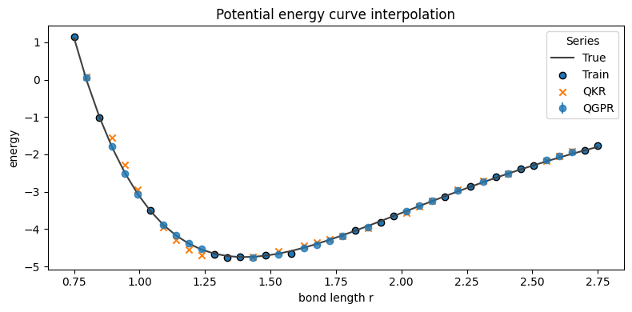


## Dynamical Systems: Lorenz Quantum Reservoir Regime Classification

Notebook: `notebooks/real_examples/10-lorenz-quantum-reservoir-regime-classifier.ipynb`

Result block 1:

```text
Dataset
+----------+----------------------------------------+
| Metric   | Value                                  |
+----------+----------------------------------------+
| Problem  | Lorenz regime classification           |
| Samples  | 40                                     |
| Classes  | {0: 'settled/periodic', 1: 'chaotic'}  |
| Features | [std_x, std_y, std_z, mean_step_speed] |
+----------+----------------------------------------+
```
Result block 2:

```text
Results
+----------------------------+----------+
| Metric                     | Value    |
+----------------------------+----------+
| Quantum reservoir accuracy | 0.916667 |
| Quantum kernel accuracy    | 1        |
| Logistic accuracy          | 1        |
+----------------------------+----------+
```
Result block 3:

```text
Validation
Dataset
+---------------+---------------------------------------------+
| Metric        | Value                                       |
+---------------+---------------------------------------------+
| problem       | lorenz_regime_classification_with_reservoir |
| n_train       | 28                                          |
| n_test        | 12                                          |
| feature_count | 4                                           |
+---------------+---------------------------------------------+

Results
+----------------------------+----------+
| Metric                     | Value    |
+----------------------------+----------+
| quantum_reservoir_accuracy | 0.916667 |
| quantum_kernel_accuracy    | 1        |
| logistic_accuracy          | 1        |
+----------------------------+----------+

Sample predictions
+---------+--------+-----------+--------+
| rho     | actual | reservoir | kernel |
+---------+--------+-----------+--------+
| 31.3047 | 1      | 1         | 1      |
| 26.8206 | 1      | 1         | 1      |
| 16.8081 | 0      | 0         | 0      |
| 30.7191 | 1      | 0         | 1      |
| 19.0278 | 0      | 0         | 0      |
+---------+--------+-----------+--------+

Passed
+--------+-------+
| Metric | Value |
+--------+-------+
| passed | True  |
+--------+-------+
```


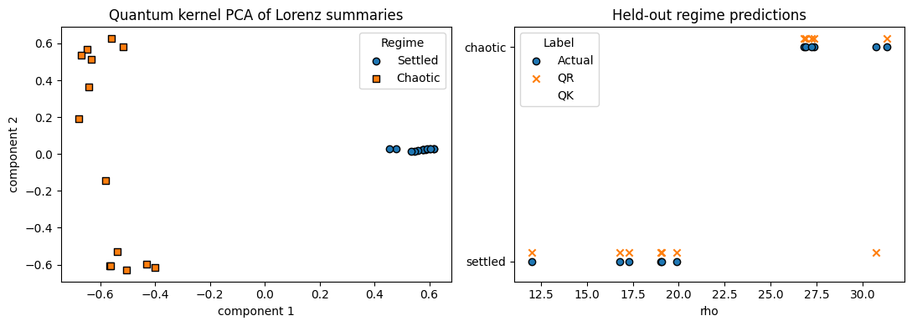

## Dynamical Systems: Noisy Oscillator Quantum Reservoir Inference

Notebook: `notebooks/real_examples/11-noisy-oscillator-quantum-reservoir-inference.ipynb`

Result block 1:

```text
Dataset
+----------+------------------------------------------+
| Metric   | Value                                    |
+----------+------------------------------------------+
| Problem  | damped oscillator damping inference      |
| Samples  | 40                                       |
| Features | [x(t=0.2), x(t=0.7), x(t=1.2), x(t=1.7)] |
| Target   | damping coefficient gamma                |
+----------+------------------------------------------+
```
Result block 2:

```text
Results
+-----------------------------+-----------+
| Metric                      | Value     |
+-----------------------------+-----------+
| Quantum reservoir gamma MAE | 0.112894  |
| Quantum GPR gamma MAE       | 0.114993  |
| Ridge gamma MAE             | 0.0389513 |
+-----------------------------+-----------+
```
Result block 3:

```text
Validation
Dataset
+---------------+---------------------------------------+
| Metric        | Value                                 |
+---------------+---------------------------------------+
| problem       | damped_oscillator_reservoir_inference |
| n_train       | 28                                    |
| n_test        | 12                                    |
| feature_count | 4                                     |
+---------------+---------------------------------------+

Results
+-----------------------------+-----------+
| Metric                      | Value     |
+-----------------------------+-----------+
| quantum_reservoir_gamma_mae | 0.112894  |
| quantum_gpr_gamma_mae       | 0.114993  |
| ridge_gamma_mae             | 0.0389513 |
+-----------------------------+-----------+

Sample predictions
+--------------+-----------------+-----------+
| actual_gamma | reservoir_gamma | gpr_gamma |
+--------------+-----------------+-----------+
| 0.087205     | 0.224281        | 0.207131  |
| 0.312743     | 0.397964        | 0.493448  |
| 0.289192     | 0.236855        | 0.338626  |
| 0.102039     | 0.269038        | 0.186091  |
| 0.266321     | 0.282579        | 0.560718  |
+--------------+-----------------+-----------+

Passed
+--------+-------+
| Metric | Value |
+--------+-------+
| passed | True  |
+--------+-------+
```

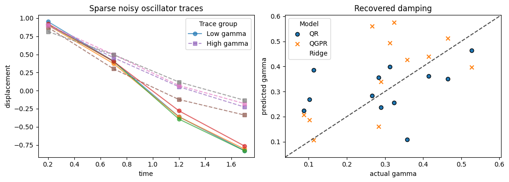


## Mathematical Physics: Heat Equation Diffusivity Inference

Notebook: `notebooks/real_examples/12-heat-equation-diffusivity-inference.ipynb`

Result block 1:

```text
Dataset
+----------+---------------------------------------------------------+
| Metric   | Value                                                   |
+----------+---------------------------------------------------------+
| Problem  | heat equation diffusivity inference                     |
| Samples  | 42                                                      |
| Features | [T(x=0.15), T(x=0.32), T(x=0.50), T(x=0.68), T(x=0.85)] |
| Target   | thermal diffusivity alpha                               |
+----------+---------------------------------------------------------+
```
Result block 2:

```text
Results
+--------------------------+------------+
| Metric                   | Value      |
+--------------------------+------------+
| Quantum GPR alpha MAE    | 0.00397051 |
| Quantum kernel alpha MAE | 0.0035871  |
| Ridge alpha MAE          | 0.00231943 |
+--------------------------+------------+
```
Result block 3:

```text
Validation
Dataset
+---------------+-------------------------------------+
| Metric        | Value                               |
+---------------+-------------------------------------+
| problem       | heat_equation_diffusivity_inference |
| n_train       | 29                                  |
| n_test        | 13                                  |
| feature_count | 5                                   |
+---------------+-------------------------------------+

Results
+--------------------------+-------------+
| Metric                   | Value       |
+--------------------------+-------------+
| quantum_gpr_alpha_mae    | 0.00397051  |
| quantum_kernel_alpha_mae | 0.0035871   |
| ridge_alpha_mae          | 0.00231943  |
| quantum_gpr_alpha_mse    | 3.74068e-05 |
+--------------------------+-------------+

Sample predictions
+--------------+-------------------+----------------------+
| actual_alpha | quantum_gpr_alpha | quantum_kernel_alpha |
+--------------+-------------------+----------------------+
| 0.140964     | 0.143786          | 0.141828             |
| 0.0818125    | 0.0805856         | 0.081059             |
| 0.0623477    | 0.0652269         | 0.0651202            |
| 0.0632763    | 0.0645743         | 0.0634716            |
| 0.0408202    | 0.0472838         | 0.0445351            |
+--------------+-------------------+----------------------+

Passed
+--------+-------+
| Metric | Value |
+--------+-------+
| passed | True  |
+--------+-------+
```

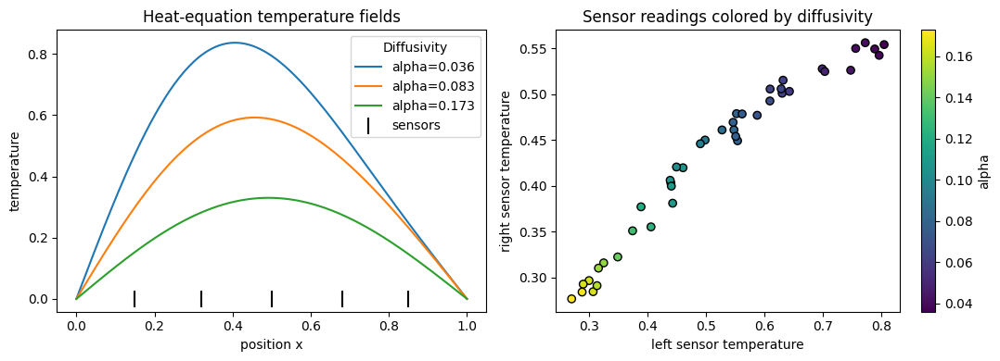
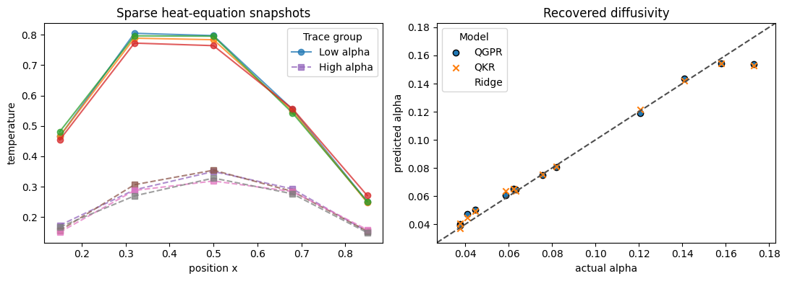

## Celestial Mechanics: Kepler Orbit Regime Classification

Notebook: `notebooks/real_examples/13-kepler-orbit-regime-classifier.ipynb`

Result block 1:

```text
Dataset
+----------+--------------------------------------------------------------------------------------------+
| Metric   | Value                                                                                      |
+----------+--------------------------------------------------------------------------------------------+
| Problem  | Kepler orbit eccentricity regime classification                                            |
| Samples  | 44                                                                                         |
| Features | [r(theta=0.00), r(theta=1.05), r(theta=2.09), r(theta=3.14), r(theta=4.19), r(theta=5.24)] |
| Classes  | {0: 'low eccentricity', 1: 'high eccentricity'}                                            |
+----------+--------------------------------------------------------------------------------------------+
```
Result block 2:

```text
Results
+----------------------------+----------+
| Metric                     | Value    |
+----------------------------+----------+
| Quantum kernel accuracy    | 1        |
| Quantum reservoir accuracy | 0.857143 |
| Logistic accuracy          | 1        |
+----------------------------+----------+
```
Result block 3:

```text
Validation
Dataset
+---------------+------------------------------------+
| Metric        | Value                              |
+---------------+------------------------------------+
| problem       | kepler_orbit_regime_classification |
| n_train       | 30                                 |
| n_test        | 14                                 |
| feature_count | 6                                  |
+---------------+------------------------------------+

Results
+----------------------------+----------+
| Metric                     | Value    |
+----------------------------+----------+
| quantum_kernel_accuracy    | 1        |
| quantum_reservoir_accuracy | 0.857143 |
| logistic_accuracy          | 1        |
+----------------------------+----------+

Sample predictions
+--------------+---------------+-----------------------+
| eccentricity | actual_regime | quantum_kernel_regime |
+--------------+---------------+-----------------------+
| 0.672496     | 1             | 1                     |
| 0.209142     | 0             | 0                     |
| 0.806813     | 1             | 1                     |
| 0.624022     | 1             | 1                     |
| 0.0893147    | 0             | 0                     |
+--------------+---------------+-----------------------+

Passed
+--------+-------+
| Metric | Value |
+--------+-------+
| passed | True  |
+--------+-------+
```

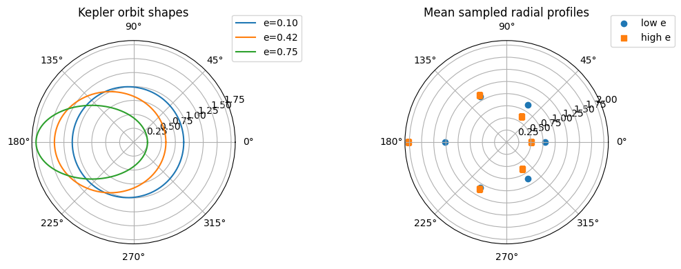
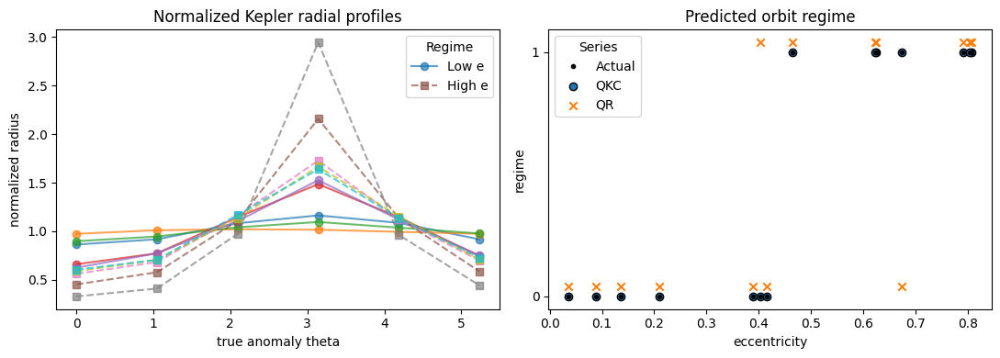

## Mathematical Physics: Vibrating Membrane Eigenfrequency Surrogate

Notebook: `notebooks/real_examples/14-vibrating-membrane-eigenfrequency-surrogate.ipynb`

Result block 1:

```text
Dataset
+----------+------------------------------------------------+
| Metric   | Value                                          |
+----------+------------------------------------------------+
| Problem  | rectangular membrane eigenfrequency surrogate  |
| Samples  | 24                                             |
| Features | [length_x, length_y, wave_speed, aspect_ratio] |
| Target   | fundamental frequency                          |
+----------+------------------------------------------------+
```
Result block 2:

```text
Results
+----------------------------------------+-----------+
| Metric                                 | Value     |
+----------------------------------------+-----------+
| Quantum kernel frequency MAE           | 0.0662286 |
| Trainable quantum kernel frequency MAE | 0.0524166 |
| Ridge frequency MAE                    | 0.033425  |
+----------------------------------------+-----------+
```
Result block 3:

```text
Validation
Dataset
+---------------+---------------------------------------------+
| Metric        | Value                                       |
+---------------+---------------------------------------------+
| problem       | vibrating_membrane_eigenfrequency_surrogate |
| n_train       | 16                                          |
| n_test        | 8                                           |
| feature_count | 4                                           |
+---------------+---------------------------------------------+

Results
+----------------------------------------+------------+
| Metric                                 | Value      |
+----------------------------------------+------------+
| quantum_kernel_frequency_mae           | 0.0662286  |
| trainable_quantum_kernel_frequency_mae | 0.0524166  |
| ridge_frequency_mae                    | 0.033425   |
| quantum_kernel_frequency_mse           | 0.00699331 |
+----------------------------------------+------------+

Sample predictions
+------------------+--------------------------+---------------------+
| actual_frequency | quantum_kernel_frequency | trainable_frequency |
+------------------+--------------------------+---------------------+
| 0.390723         | 0.430414                 | 0.31475             |
| 0.627319         | 0.633867                 | 0.647667            |
| 0.458232         | 0.525136                 | 0.418127            |
| 0.641746         | 0.584093                 | 0.630248            |
| 0.402231         | 0.494952                 | 0.342284            |
+------------------+--------------------------+---------------------+

Passed
+--------+-------+
| Metric | Value |
+--------+-------+
| passed | True  |
+--------+-------+
```

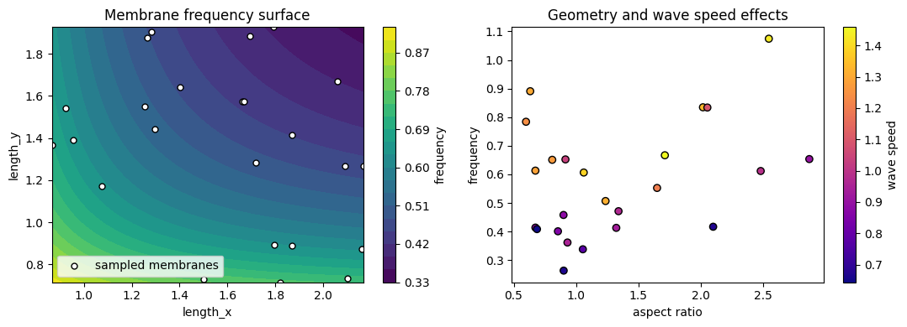
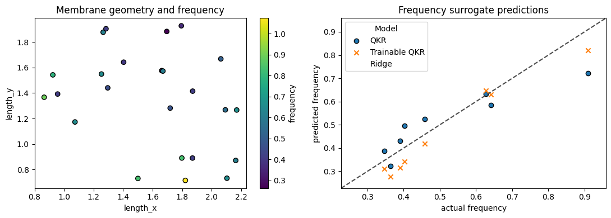

## Chemical Physics: Arrhenius Activation Energy Inference

Notebook: `notebooks/real_examples/15-arrhenius-reaction-activation-energy-inference.ipynb`

Result block 1:

```text
Dataset
+----------+--------------------------------------------------------------+
| Metric   | Value                                                        |
+----------+--------------------------------------------------------------+
| Problem  | Arrhenius activation energy inference                        |
| Samples  | 38                                                           |
| Features | [C(T=295 K), C(T=315 K), C(T=335 K), C(T=355 K), C(T=375 K)] |
| Target   | activation energy Ea                                         |
+----------+--------------------------------------------------------------+
```
Result block 2:

```text
Results
+-----------------------+----------+
| Metric                | Value    |
+-----------------------+----------+
| Quantum GPR Ea MAE    | 0.416631 |
| Quantum kernel Ea MAE | 0.424169 |
| Ridge Ea MAE          | 0.793175 |
+-----------------------+----------+
```
Result block 3:

```text
Validation
Dataset
+---------------+---------------------------------------+
| Metric        | Value                                 |
+---------------+---------------------------------------+
| problem       | arrhenius_activation_energy_inference |
| n_train       | 26                                    |
| n_test        | 12                                    |
| feature_count | 5                                     |
+---------------+---------------------------------------+

Results
+--------------------------------------+----------+
| Metric                               | Value    |
+--------------------------------------+----------+
| quantum_gpr_activation_energy_mae    | 0.416631 |
| quantum_kernel_activation_energy_mae | 0.424169 |
| ridge_activation_energy_mae          | 0.793175 |
| quantum_gpr_activation_energy_mse    | 0.637986 |
+--------------------------------------+----------+

Sample predictions
+--------------------------+--------------------+-----------------------+
| actual_activation_energy | quantum_gpr_energy | quantum_kernel_energy |
+--------------------------+--------------------+-----------------------+
| 17.2036                  | 17.3653            | 17.3632               |
| 10.1722                  | 10.0827            | 10.0883               |
| 11.5282                  | 11.494             | 11.4831               |
| 16.5089                  | 16.7723            | 16.7452               |
| 7.94759                  | 10.5749            | 10.7777               |
+--------------------------+--------------------+-----------------------+

Passed
+--------+-------+
| Metric | Value |
+--------+-------+
| passed | True  |
+--------+-------+
```

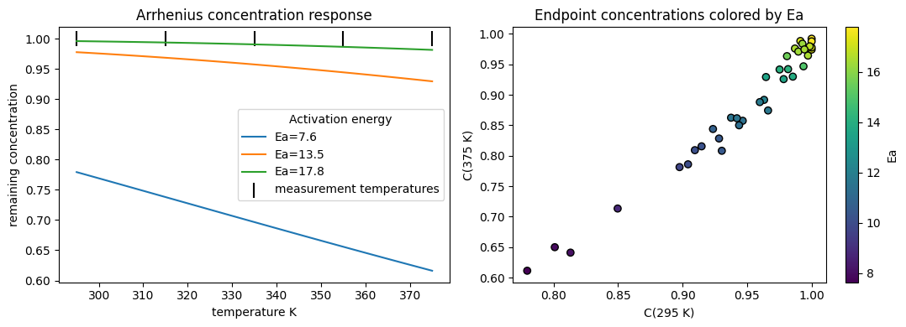
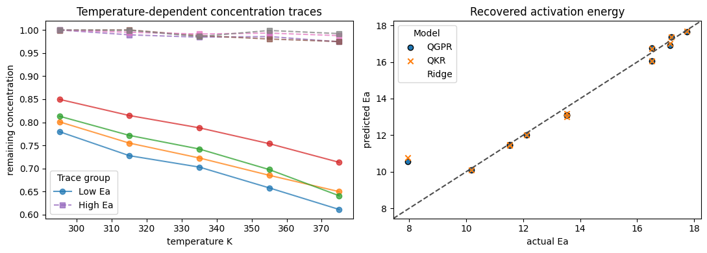

## Mathematical Physics: Wave Equation Boundary Condition Classification

Notebook: `notebooks/real_examples/16-wave-equation-boundary-condition-classifier.ipynb`

Result block 1:

```text
Dataset
+----------+--------------------------------------------------+
| Metric   | Value                                            |
+----------+--------------------------------------------------+
| Problem  | wave equation boundary condition classification  |
| Samples  | 42                                               |
| Features | [f1/f1, f2/f1, f3/f1, f4/f1, scaled fundamental] |
| Classes  | {0: 'fixed-fixed', 1: 'fixed-free'}              |
+----------+--------------------------------------------------+
```
Result block 2:

```text
Results
+----------------------------+----------+
| Metric                     | Value    |
+----------------------------+----------+
| Quantum kernel accuracy    | 1        |
| Quantum reservoir accuracy | 0.846154 |
| Logistic accuracy          | 1        |
+----------------------------+----------+
```
Result block 3:

```text
Validation
Dataset
+---------------+-------------------------------------------------+
| Metric        | Value                                           |
+---------------+-------------------------------------------------+
| problem       | wave_equation_boundary_condition_classification |
| n_train       | 29                                              |
| n_test        | 13                                              |
| feature_count | 5                                               |
+---------------+-------------------------------------------------+

Results
+----------------------------+----------+
| Metric                     | Value    |
+----------------------------+----------+
| quantum_kernel_accuracy    | 1        |
| quantum_reservoir_accuracy | 0.846154 |
| logistic_accuracy          | 1        |
+----------------------------+----------+

Sample predictions
+-----------------+-------------------------+--------------------+
| actual_boundary | quantum_kernel_boundary | reservoir_boundary |
+-----------------+-------------------------+--------------------+
| 0               | 0                       | 0                  |
| 0               | 0                       | 0                  |
| 0               | 0                       | 0                  |
| 0               | 0                       | 0                  |
| 0               | 0                       | 0                  |
+-----------------+-------------------------+--------------------+

Passed
+--------+-------+
| Metric | Value |
+--------+-------+
| passed | True  |
+--------+-------+
```

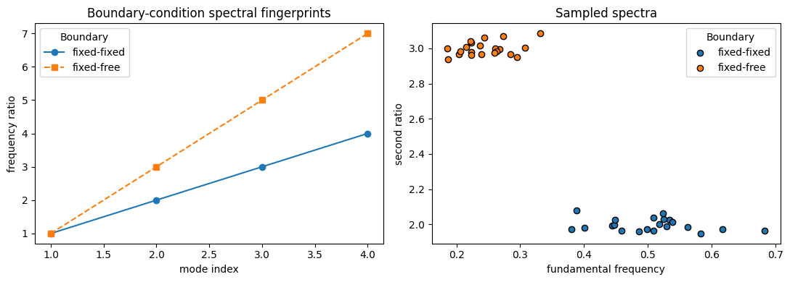
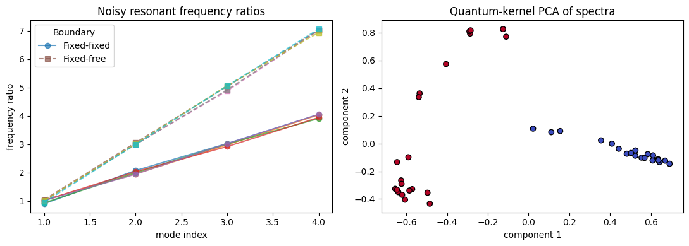

## Optics: Diffraction Pattern Anomaly Classification

Notebook: `notebooks/real_examples/17-optical-diffraction-anomaly-detection.ipynb`

Result block 1:

```text
Dataset
+--------------------+-------------------------------------------------------------------------------------------------------+
| Metric             | Value                                                                                                 |
+--------------------+-------------------------------------------------------------------------------------------------------+
| Problem            | optical diffraction anomaly classification                                                            |
| Nominal profiles   | 24                                                                                                    |
| Anomalous profiles | 24                                                                                                    |
| Features           | [I(theta=-3.0), I(theta=-2.0), I(theta=-1.0), I(theta=0.0), I(theta=1.0), I(theta=2.0), I(theta=3.0)] |
| Classes            | {0: 'nominal', 1: 'anomalous'}                                                                        |
+--------------------+-------------------------------------------------------------------------------------------------------+
```
Result block 2:

```text
Results
+----------------------------+----------+
| Metric                     | Value    |
+----------------------------+----------+
| Quantum kernel accuracy    | 1        |
| Quantum reservoir accuracy | 0.466667 |
| Logistic accuracy          | 1        |
| Quantum anomaly recall     | 1        |
+----------------------------+----------+
```
Result block 3:

```text
Validation
Dataset
+---------------+--------------------------------------------+
| Metric        | Value                                      |
+---------------+--------------------------------------------+
| problem       | optical_diffraction_anomaly_classification |
| n_train       | 33                                         |
| n_test        | 15                                         |
| feature_count | 7                                          |
+---------------+--------------------------------------------+

Results
+----------------------------+----------+
| Metric                     | Value    |
+----------------------------+----------+
| quantum_kernel_accuracy    | 1        |
| quantum_reservoir_accuracy | 0.466667 |
| logistic_accuracy          | 1        |
| quantum_anomaly_recall     | 1        |
+----------------------------+----------+

Sample predictions
+--------------+---------------------------+----------------------+
| actual_label | quantum_kernel_prediction | reservoir_prediction |
+--------------+---------------------------+----------------------+
| 0            | 0                         | 1                    |
| 1            | 1                         | 1                    |
| 0            | 0                         | 1                    |
| 1            | 1                         | 1                    |
| 0            | 0                         | 1                    |
+--------------+---------------------------+----------------------+

Passed
+--------+-------+
| Metric | Value |
+--------+-------+
| passed | True  |
+--------+-------+
```

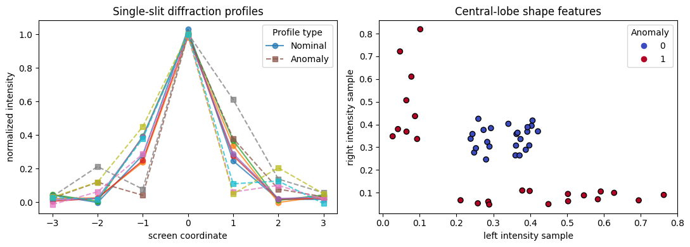
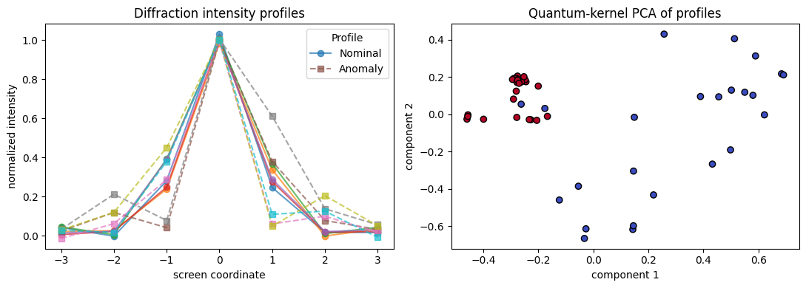

## Reproduce

Regenerate notebook result pages from existing executed notebook outputs:

```bash
python docs/pages/generate_results.py --skip-api-results
```

Execute notebooks first, then regenerate result pages:

```bash
python docs/pages/generate_results.py --skip-api-results --execute-notebooks
```
